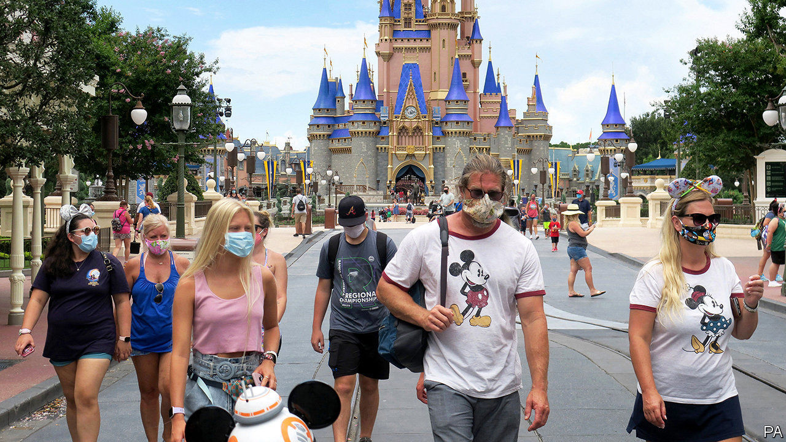
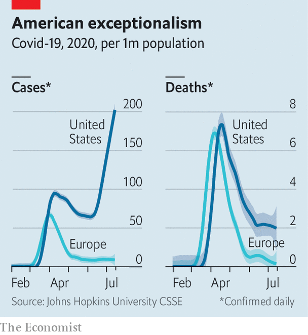

## Covid deaths v cases

# America is in the midst of an extraordinary surge of covid-19

> Will the gap between cases and deaths persist?

> Jul 18th 2020WASHINGTON, DC

ON THE SAME weekend that Florida smashed the single-day state record for cases of covid-19—reporting over 15,000 in one day—Disney World, the gargantuan theme park in Orlando, opened its doors to masked revellers. At the start of June, when cases and deaths looked to be declining after reaching the terrible milestone of 100,000 dead, America appeared to have managed its epidemic as well as Europe—neither superbly nor awfully. Both began opening then at roughly the same time.

There was one difference, however. Some American states began reopening even as infection looked to be growing, as governors sought to cast off the shackles of locked-down life and a half-open economy. Bars crowded with thirsty patrons, restaurants reopened. There were some mass gatherings, whether to protest against racial injustice or to attend the president’s restarted rallies. Six weeks later, America is facing a secondary surge of cases quite unlike any other country. Having muddled along just about as well as other Western democracies, America now looks to be exceptional, in a disastrous way.

Some states, like California, which seemed to be early success stories in containing covid have also been beset by surges. On July 13th Gavin Newsom, the governor, announced that bars, indoor restaurants and cinemas would be closed to arrest the spread of the virus. On the same day schools in Los Angeles and San Diego announced that for 600,000 pupils the fall semester would begin online-only.

Predicting the course of the virus has proved remarkably difficult. When Ron DeSantis and Greg Abbott, the Republican governors of Florida and Texas, delayed stay-at-home orders in March they seemed to be inviting the virus to spread. That wave has now arrived as predicted, only three months late. Governors did not heed the warning signs—a rise in the share of tests coming back positive, reports of increased hospitalisations—until too late.

Doug Ducey, the Republican governor of Arizona, began reopening his state in early May, when there were around 400 new cases being detected a day. He began backtracking two months later, after caseloads had swollen tenfold, to around 4,000 a day, and 90% of the intensive-care beds in the state were occupied. Mr Ducey, like many Republican governors, had also barred cities in his state from imposing their own mask-wearing requirements, only reversing himself on June 17th.

Nor was there much desire for caution from the White House. Vice-President Mike Pence wrote an op-ed for the Wall Street Journal on June 16th with the headline “There Isn’t a Coronavirus ‘Second Wave’”, arguing that “the media has tried to scare the American people every step of the way, and these grim predictions of a second wave are no different.” A key argument of Mr Pence and President Donald Trump, even as case counts were rising through June, was that this was an artefact of increased testing and that the death rates continued to decline. Though the first contention was questionable (the rate of increase in cases exceeded the rate of increase in tests), the second was true.

That puzzle—why deaths remain flat while cases have begun another exponential rise—can be explained by four factors. First, the substantial increase in testing means that more cases will be detected. Second, evidence suggests that younger adults are behind the latest surge in the virus. In Florida the median age of covid-19 patients has dropped from 65 to near 40. Third, there is usually a lag of several weeks between a patient contracting the illness and when the patient’s death is reported to state authorities. Fourth, doctors seem to have become better at treating severe cases of covid-19, reducing the death rate even for those who must be hospitalised.

Given the rise in cases, however, it seems unlikely that the death rate will remain stagnant for much longer. Deaths for patients infected weeks ago will probably start to pile up. Some morgues in Arizona and Texas are running out of capacity and are already seeking refrigerated trucks, just as those in New York City did months ago. Uncontrolled community transmission among young people is likely to result in a spread in nursing homes, where a large share of fatalities occurs among the more vulnerable elderly. Should hospital capacity become strained, as appears to be the case in Houston, the quality of care could deteriorate and result in increased deaths as well.

Denial has not proved to be a particularly effective virus-suppression strategy. When polled by YouGov last week, a third of Americans who had voted for Mr Trump said they thought covid-19 was either a minor problem nationwide or not a problem at all. A recent Gallup poll showed that 94% of Democrats say they always or very often wear a mask when outside their homes compared with 46% of Republicans (and 68% of independents). To many voters, worry about the virus transmuted into coded disapproval of the president; mask-wearing is seen as a talisman of deranged coastal liberalism.

Mr Abbott, who while running for governor bragged about how many times he had sued Barack Obama’s administration, is facing a mild insurrection in Texas from counties over his imposition of a mask requirement. Localised control, which once appeared to be a compensating feature of the American system, may now be working against containment. Confusing back-and-forths between Mr Newsom and counties in California have hindered timelier action there too. These are co-ordination problems that the federal government ought to solve. But throughout the crisis the White House has not seemed interested. Once again, states and cities will probably have to do the hard work alone.■

Editor’s note: Some of our covid-19 coverage is free for readers of The Economist Today, our daily [newsletter](https://www.economist.com/https://my.economist.com/user#newsletter). For more stories and our pandemic tracker, see our [hub](https://www.economist.com//news/2020/03/11/the-economists-coverage-of-the-coronavirus)

## URL

https://www.economist.com/united-states/2020/07/18/america-is-in-the-midst-of-an-extraordinary-surge-of-covid-19
