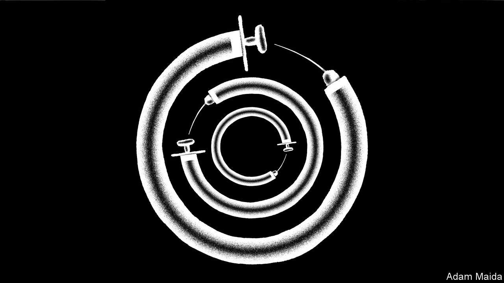
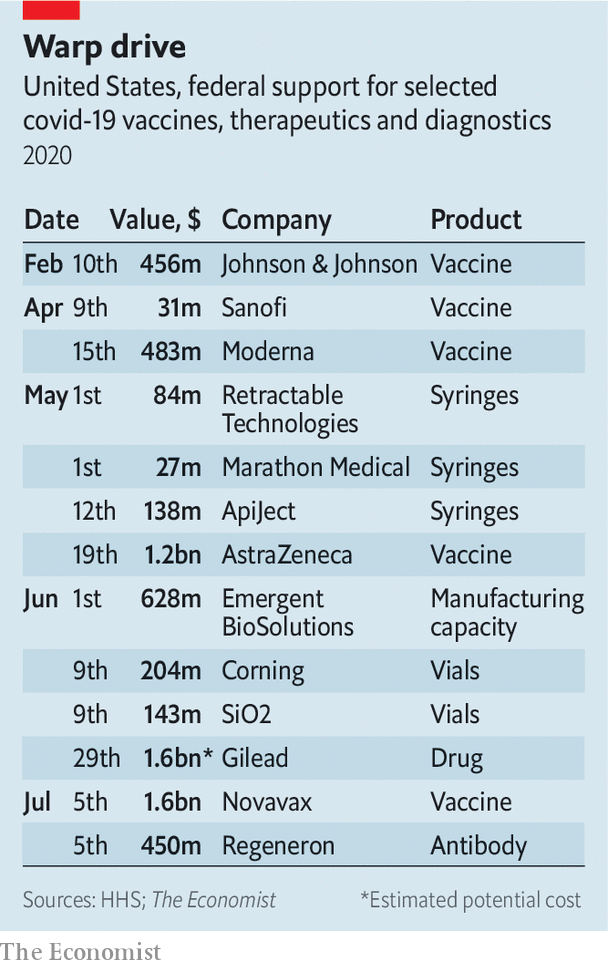

## Operation Warp Speed

# Donald Trump is hoping for a covid-19 treatment by November

> He might get one

> Jul 18th 2020

Editor’s note: Some of our covid-19 coverage is free for readers of The Economist Today, our daily [newsletter](https://www.economist.com/https://my.economist.com/user#newsletter). For more stories and our pandemic tracker, see our [hub](https://www.economist.com//news/2020/03/11/the-economists-coverage-of-the-coronavirus)

IT IS EASY to smirk at the president. When it comes to the pandemic, he seems to be wrong about almost everything. He has promoted a dud malaria drug, said the virus would disappear, and even that 99% of cases of covid-19 are harmless. No wonder there is scepticism when Donald Trump says there will be a vaccine or a drug by the end of the year. But could he be right? After all, the government is spending more than $13bn on this goal and pursuing an aggressive strategy to achieve it.

The push to bankroll the rapid development of vaccines started in April. Operation Warp Speed (OWS) is a partnership between Health and Human Services, the Department of Defence and an alphabet soup of health-related agencies. The goal is to deliver 300m doses of a vaccine by January. OWS is also buying into medicines known as antibody therapies, and is part of a broader government strategy to accelerate the arrival of drugs and diagnostic tests. As part of this effort, the government triggered international outrage at the end of June when it bought up most of the supply of the drug remdesivir that the drug firm Gilead has for the next quarter.

Peter Bach, director of the Centre for Health Policy and Outcomes, an academic institute in New York, describes the effort as turning on the federal money hose. Already $3bn of federal cash has been spent on two vaccines in particular, one made by AstraZeneca, and another by Novavax. The biotech firm Moderna has been given $483m. The agreement with AstraZeneca includes the advance purchase of 300m doses of vaccine; the first doses could arrive as early as October this year. Novavax has agreed to deliver 100m doses of its vaccine by “late 2020”. The deal with Moderna allows for “large-scale” production in 2020. The money being directed at vaccine makers is also geared to helping firms scale up development and mass manufacturing.

In effect the government is subsidising the creation of a product that may not work. The strategy, which is also being employed by governments elsewhere, is necessary to help shave months off the development time for vaccines. Firms might otherwise be likely to wait for evidence of efficacy from trials before investing in manufacturing. OWS is investing in a wide range of vaccines because a number are likely to fail. The scale of the effort is so large that it has also been necessary to step up the national production of syringes.

Although OWS is described as a public-private partnership, the government is stumping up a lot of cash and shouldering a lot of risk. Matthew Kavanagh, a professor of global health at Georgetown University, worries that the government has too few levers to pull with the firms and that there is little transparency over how winners are being picked. Others worry about the affordability and cost of these eventual vaccines. American efforts to gain access to German and French vaccines have also sparked controversy in those countries.

Critics of the European Commission, including the boss of Sanofi, Paul Hudson, have accused it of dragging its feet in funding covid-19 research when compared with America. But the US government’s purchase of remdesivir caused alarm in many other rich countries, which fear that a drug that improves recovery time will be hard to obtain for their own patients. The move to corner the supply of this drug looked particularly bad abroad because the trials necessary to show that the drug worked involved patients in Germany, Greece, Japan, Korea, Spain and Britain.

Less noticed, but potentially incendiary, was a similar American move on July 7th, when OWS signed a deal worth $450m with Regeneron. This acquired most of Regeneron’s supply of a promising experimental therapy, REG-COV2, for the next three months. If it turns out to work, most other countries will be unable to get hold of it. A spokesperson said the firm is working on plans to meet demand elsewhere.

The government’s money is not universally appealing to the pharma industry. The giant drug firm Pfizer has rejected cash from OWS. Its boss, Albert Bourla, says working with the government would slow the firm down. That fear seems to be justified. Work by Moderna, a biotech firm, appears to have been delayed amid reports of squabbles between the firm and the federal government over the design of trials.

Yet with the eagerness of the pharma sector to find treatments, along with the broad range of investments made by OWS (as well as other governments) there has been a lot of progress in the search for tests, drugs and vaccines. AstraZeneca has started late-stage trials, and Moderna and Pfizer are expected to do the same before the end of the summer. Even the master of caution on vaccines, Anthony Fauci, director of the National Institute of Allergy and Infectious Diseases, thinks a signal of vaccine efficacy might arrive in September. If data from trials emerges to suggest that a vaccine works, the Food and Drug Administration (FDA) will have to decide whether to grant an Emergency Use Authorisation (EUA).

Assuming these vaccines work, a best-case scenario could put an EUA for a vaccine well before the November election. A signal from the trials of the Regeneron drug is expected by the end of the summer. If it works, the federal government looks likely to be sitting on most of the world’s supply of the drug. All this means that Mr Trump has a reasonable chance at being right about there being a drug or vaccine by the end of the year. More significantly, analysts at Morgan Stanley think that the sort of early data that now looks possible in the coming months, would allow investors to “look through” any negative headlines in the economic recovery. This has the potential to help Mr Trump at the polls.

That would heighten concerns over how the government might apply pressure on the FDA to cut corners when approving a vaccine. Commissioner Stephen Hahn has said this will not happen. However his agency has been blasted for granting an EUA for the malaria drug hydroxychloroquine, an approval that seems mainly to have been designed to avoid embarrassing the president, who endorsed the drug as a treatment without any evidence.

Confidence in a covid-19 vaccine is essential. There are also concerns over the influence of anti-vaxxers in the uptake of any new vaccine. A poll in May found that half of Americans would take a vaccine, and one in five would refuse. Yet history shows that outbreaks of disease can be persuasive. The California Disneyland measles outbreak in 2014 gave a boost to childhood vaccination rates. The pandemic has even triggered a spike in demand for flu vaccine with one prescription drug firm, SingleCare, saying it saw a 500% increase in demand.

Even if a covid-19 vaccine is only 50% effective, and taken by less than half the population, experience with the flu jab suggests that it would be life-saving. A bigger concern, though, is whether a vaccine would get to those most at risk from covid-19. Persistent racial disparities already exist in flu-vaccination rates, with 9% and 12% lower coverage among black, non-Hispanics and Hispanic Americans, respectively, as compared with the vaccination rate of whites.

Successful therapies, particularly those supported by OWS, would give Mr Trump something to brag about on the campaign Zoom trail. Yet it seems unlikely to blunt much of the effect of the disastrous increase in cases of covid-19 (see [article](https://www.economist.com//united-states/2020/07/18/america-is-in-the-midst-of-an-extraordinary-surge-of-covid-19)). The administration is keen to paint OWS in heroic terms, describing it as the “one of the greatest scientific and humanitarian accomplishments in history.” The reality is that even if international efforts help to create the knowledge to defeat covid-19, America looks unwilling to share the humanitarian gains outside its own borders.

The administration has shunned international efforts to co-operate on vaccines. On July 7th it said it would begin the process of withdrawing from the World Health Organisation, which plays a key role in organising the global distribution of vaccines, drugs and diagnostics. There is a strong argument that vaccines will be more efficiently deployed when delivered to the high-risk populations around the world rather than through near universal vaccination of a few rich countries such as America. That argument has not been very persuasive with this administration, but Mr Trump did promise America First. ■