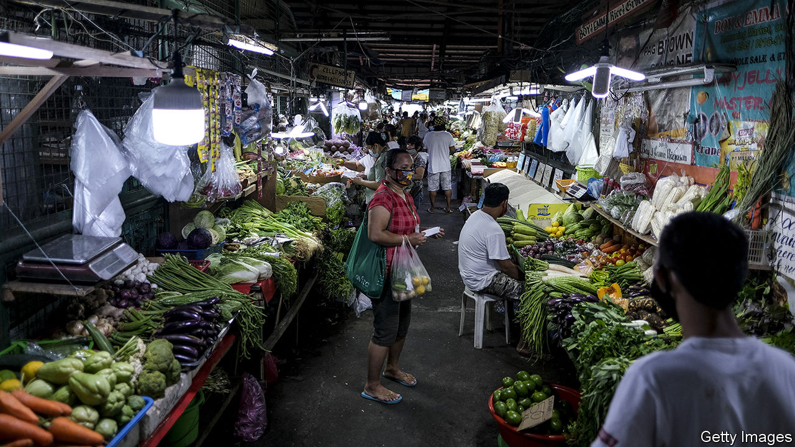
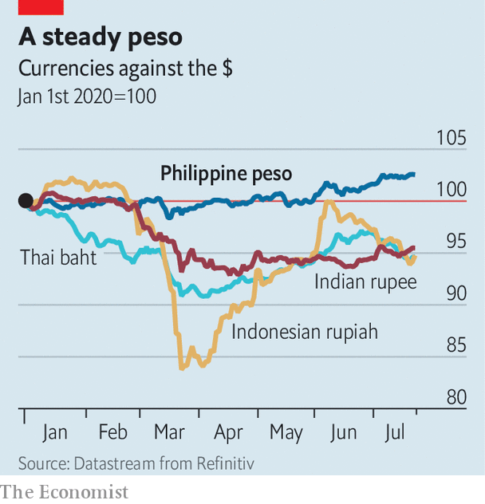

## A milder infection

# The Philippine peso is the champion of emerging-market currencies

> Relatively low external debts, high reserves and resilient remittances have kept it buoyant

> Jul 23rd 2020

IN MARCH PROSPECTS for the Philippine economy were darkening. The country’s combustible president, Rodrigo Duterte, had announced an immediate quarantine for the main island of Luzon and its 55m people. Bangko Sentral ng Pilipinas (BSP), the central bank, warned that the outlook was the worst since the Asian financial crisis of 1997-98. The currencies of other countries in the region were sinking as the world economy listed. But the peso barely budged (see chart). It is one of a handful of emerging-market currencies to have strengthened against the dollar this year. Its steadfastness says a lot about the resilience of the Philippine economy.

It helped that the oil price was plunging (and consumption within the country was falling), dramatically cutting the Philippines’ import bill. The BSP did cut interest rates to keep credit flowing, which in normal times might have caused the peso to weaken. But Nicholas Mapa of ING, a bank, thinks foreign investors held on to Philippine assets because interest rates remain higher than in rich countries, yet the Philippines is seen as a safer bet than most other emerging markets.

In part that is because remittances, which keep the economy afloat, have held up quite well so far. They fell by only 3% in the first four months of 2020. Inflows can even increase during periods of domestic economic weakness, as the diaspora responds to distress calls from home. Gareth Leather of Capital Economics, a consultancy, points out that lots of Filipino expatriates work in health care, and so are likely to retain their jobs even as migrants working in construction, say, lose theirs.

The public finances have also been prudently managed in recent years. Fairly thrifty budgets combined with rapid economic growth have brought down the ratio of public debt to GDP from more than 70% in the mid-2000s to less than 40% in 2019. Relative to the size of the economy, foreign debts are lower than in Malaysia, Indonesia or Thailand. The BSP has built up $93bn of foreign-exchange reserves—a record stash.

But the Philippines’ relative economic stability, and the buoyancy it has bestowed on the peso, are not unalloyed benefits. The peso’s strength makes Philippine exports more expensive and remittances less valuable. And if the world economy is heading down the tubes, it is scant comfort that other emerging markets are descending faster.