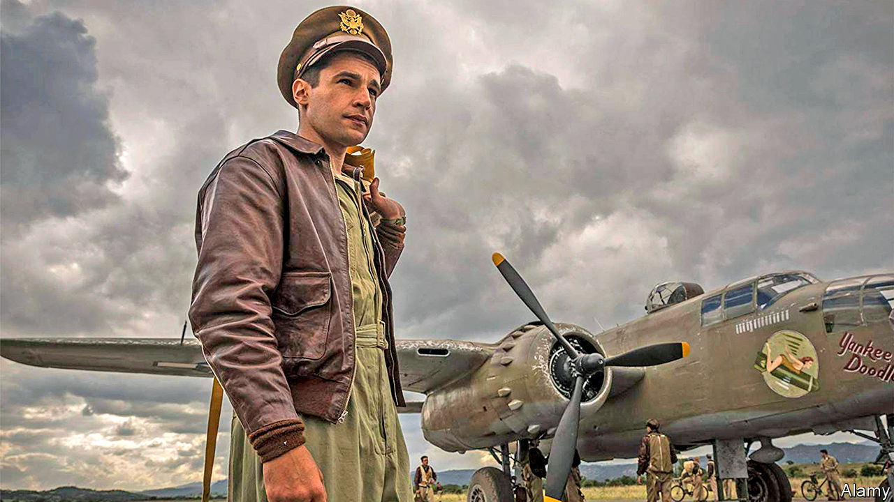

## Home Entertainment

# “Catch-22” and the caprices of bureaucracy

> Joseph Heller’s comic war novel resonates anew during the pandemic

> Jul 23rd 2020

AT THE BEGINNING of “Catch-22” Captain Yossarian vows “to live forever or die in the attempt”. Though the odds are stacked against him, he tirelessly resists anyone and everything that wants to kill him. This broad category includes the German army, his own commanders with their dangerous missions and even the cells in his body, because “every one was a potential traitor and foe”.

Set mainly in an American air-force base towards the end of the second world war, Joseph Heller’s story seemed unlike other war novels when it was published in 1961. Rather than hailing martial bravery, it lambasted the era’s violence and paranoia, as well as bungling bureaucrats and capricious rules of a kind that are freshly recognisable today. Early reviewers called the book “repetitive and monotonous”, but younger readers appreciated Heller’s extravagantly constructed jokes, in which the punchline may come hundreds of pages after the set-up. Above all they identified with the authority-questioning Yossarian, the closest thing “Catch-22” has to a hero.

Later adapted for film and television, the novel follows the captain and around 70 other characters in a bafflingly non-linear plot. Some of them are megalomaniacs, others amoral profiteers; the enlisted men are variously jaded, idealistic and suicidal. Some die, come back, and die all over again. Events slide into each other, loosening the reader’s grasp on time, much as the languor of lockdown can seem to. Incidents are revisited from alternative points of view, first played for laughs and later depicted as tragedies. (Heller made an enormous handwritten plan for the book to keep track of the timeline.)

The phrase “Catch-22” has since entered the language, making the novel vaguely familiar even to those who have never read it. In the story, air-force regulation “Catch-22” says that insane servicemen cannot be excused combat duty, because trying to get out of it implies concern for their safety—meaning they must be sane after all. But the phrase quickly became shorthand for any predicament from which escape is impossible because of an inherent contradiction. Everyone encounters these: an entry-level job advert that stipulates “experience required”; being unable to find a lost pair of glasses because you cannot see. Some of the dilemmas of the pandemic—public-health measures that are meant to save lives, but might end up blighting them—have a Catch-22 feel.

“Yossarian lives”, a slogan that was plastered on subway carriages in New York in the 1960s, may have been a bit of a spoiler, but it captures the consolation that the novel ultimately offers. Today the captain and his friends are offbeat guides to a risky, maddening and rule-bound life. And Heller’s inimitable comic voice is a reminder that humour and humanity might just see you through. ■

## URL

https://www.economist.com/books-and-arts/2020/07/23/catch-22-and-the-caprices-of-bureaucracy
