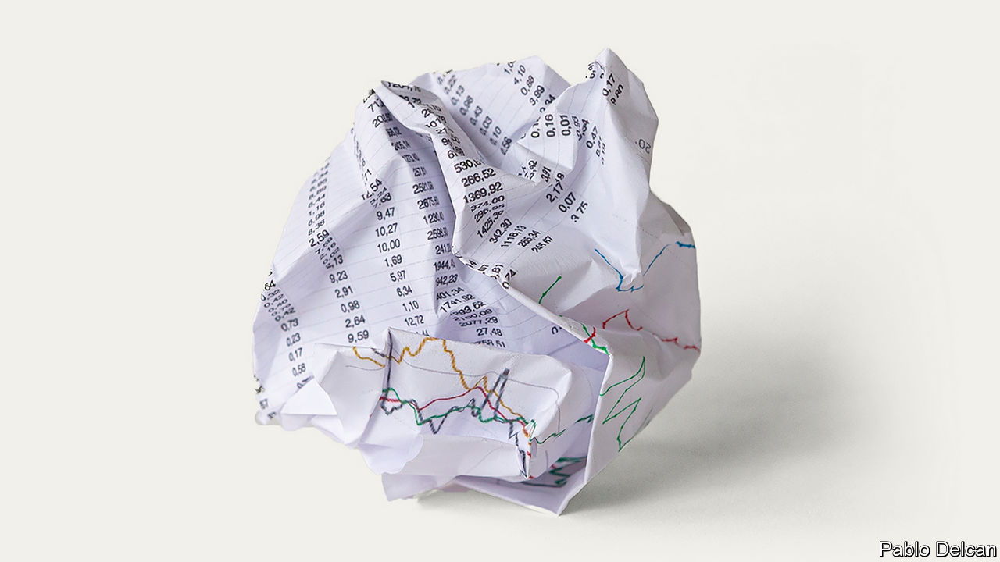
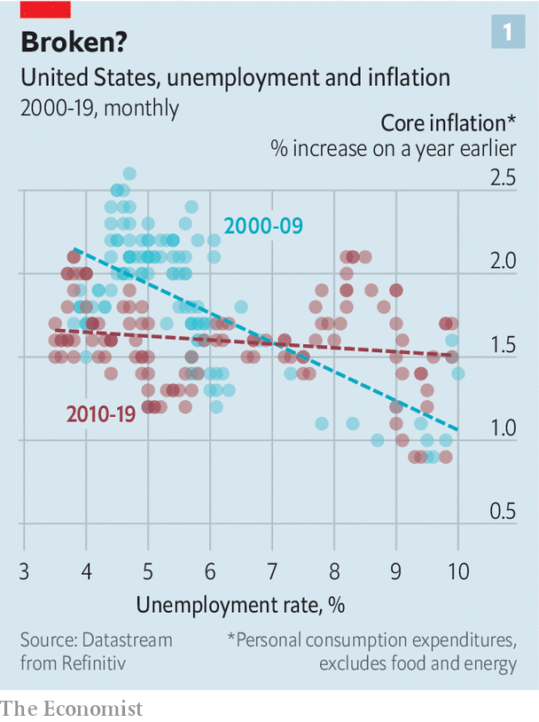
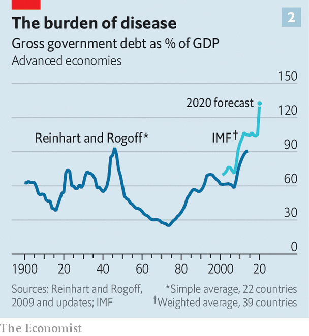
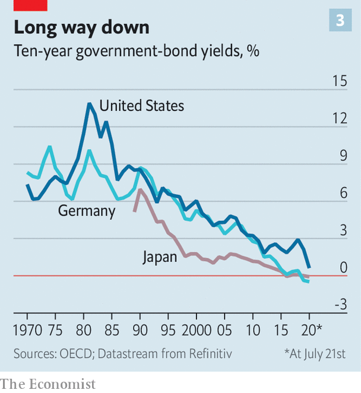
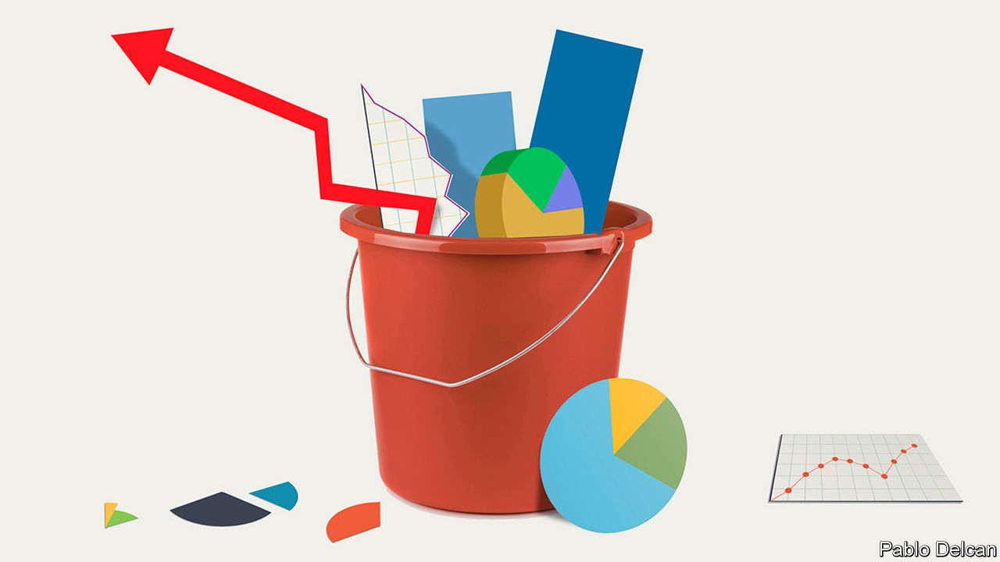

## Starting over again

# The covid-19 pandemic is forcing a rethink in macroeconomics

> It is not yet clear where it will lead

> Jul 25th 2020

Editor’s note: Some of our covid-19 coverage is free for readers of The Economist Today, our daily [newsletter](https://www.economist.com/https://my.economist.com/user#newsletter). For more stories and our pandemic tracker, see our [hub](https://www.economist.com//news/2020/03/11/the-economists-coverage-of-the-coronavirus)

IN THE FORM it is known today, macroeconomics began in 1936 with the publication of John Maynard Keynes’s “The General Theory of Employment, Interest and Money”. Its subsequent history can be divided into three eras. The era of policy which was guided by Keynes’s ideas began in the 1940s. By the 1970s it had encountered problems that it could not solve and so, in the 1980s, the monetarist era, most commonly associated with the work of Milton Friedman, began. In the 1990s and 2000s economists combined insights from both approaches. But now, in the wreckage left behind by the coronavirus pandemic, a new era is beginning. What does it hold?

The central idea of Keynes’s economics is the management of the business cycle—how to fight recessions and ensure that as many people who want work can get it. By extension, this key idea became the ultimate goal of economic policy. Unlike other forms of economic theory in the early 20th century, Keynesianism envisaged a large role for the state in achieving that end. The experience of the Great Depression had convinced proto-Keynesians that the economy was not a naturally correcting organism. Governments were supposed to run large deficits (ie, spending more than they took in taxes) during downturns to prop up the economy, with the expectation that they would pay down the accumulated debt during the good times.

The Keynesian paradigm collapsed in the 1970s. The persistently high inflation and high unemployment of that decade (“stagflation”) baffled mainstream economists, who thought that the two variables almost always moved in opposite directions. This in turn convinced policymakers that it was no longer possible to “spend your way out of a recession”, as James Callaghan, then Britain’s prime minister, conceded in 1976. A central insight of Friedman’s critique of Keynesianism was that if policymakers tried to stimulate without tackling underlying structural deficiencies then they would raise inflation without bringing unemployment down. And high inflation could then persist, just because it was what people came to expect.

Policymakers looked for something new. The monetarist ideas of the 1980s inspired Paul Volcker, then chairman of the Federal Reserve, to crush inflation by constraining the money supply, even though doing so also produced a recession that sent unemployment soaring. The fact that Volcker had known that this would probably happen revealed that something else had changed. Many monetarists argued that policymakers before them had focused too much on equality of incomes and wealth to the detriment of economic efficiency. They needed instead to focus on the basics—such as low and stable inflation—which would, over the long run, create the conditions in which living standards would rise.

In the 1990s and 2000s a synthesis of Keynesianism and Friedmanism emerged. It eventually recommended a policy regime loosely known as “flexible inflation targeting”. The central objective of the policy was to achieve low and stable inflation—though there was some room, during downturns, to put employment first even if inflation was uncomfortably high. The primary tool of economic management was the raising and lowering of short-term interest rates, which, it had turned out, were more reliable determinants of consumption and investment than the money supply. Central banks’ independence from governments ensured that they would not fall into the inflationary traps of which Friedman warned. Fiscal policy, as a way to manage the business cycle, was sidelined, in part because it was seen to be too subject to political influence. The job of fiscal policy was to keep public debts low, and to redistribute income to the degree and in the way that politicians saw fit.

Now it seems that this dominant economic paradigm has reached its limit. It first began to wobble after the global financial crisis of 2007-09, as policymakers were confronted by two big problems. The first was that the level of demand in the economy—broadly, the aggregate desire to spend relative to the aggregate desire to save—seemed to have been permanently reduced by the crisis. To fight the downturn central banks slashed interest rates and launched quantitative easing (QE, or printing money to buy bonds). But even with extraordinary monetary policy, the recovery from the crisis was slow and long. GDP growth was weak. Eventually, labour markets boomed, but inflation remained muted (see chart 1). The late 2010s were simultaneously the new 1970s and the anti-1970s: inflation and unemployment were once again not behaving as expected, though this time they were both surprisingly low.

This threw into question the received wisdom about how to manage the economy. Central bankers faced a situation where the interest rate needed to generate enough demand was below zero. That was a point they could not easily reach, since if banks tried to charge negative interest rates, their customers might simply withdraw their cash and stuff it under the mattress. QE was an alternative policy instrument, but its efficacy was debated. Such disputes prompted a rethink. According to a working paper published in July by Michael Woodford and Yinxi Xie of Columbia University the “events of the period since the financial crisis of 2008 have required a significant reappraisal of the previous conventional wisdom, according to which interest-rate policy alone...should suffice to maintain macroeconomic stability.”

The second post-financial-crisis problem related to distribution. While concerns about the costs of globalisation and automation helped boost populist politics, economists asked in whose interests capitalism had lately been working. An apparent surge in American inequality after 1980 became central to much economic research. Some worried that big firms had become too powerful; others, that a globalised society was too sharp-edged or that social mobility was declining.

Some argued that structurally weak economic growth and the maldistribution of the spoils of economic activity were related. The rich have a higher tendency to save rather than spend, so if their share of income rises then overall saving goes up. Meanwhile in the press central banks faced accusations that low interest rates and QE were driving up inequality by boosting the prices of housing and equities.

Yet it was also becoming clear just how much economic stimulus could benefit the poor, if it caused unemployment to drop sufficiently for wages for low-income folk to rise. Just before the pandemic a growing share of GDP across the rich world was accruing to workers in the form of wages and salaries. The benefits were greatest for low-paid workers. “We are hearing loud and clear that this long recovery is now benefiting low- and moderate-income communities to a greater extent than has been felt for decades,” said Jerome Powell, the Fed’s chair, in July 2019. The growing belief in the redistributive power of a booming economy added to the importance of finding new tools to replace interest rates to manage the business cycle.

Then coronavirus hit. Supply chains and production have been disrupted, which all else being equal should have caused prices to surge as raw materials and finished goods were harder to come by. But the bigger impact of the pandemic has been on the demand side, causing expectations for future inflation and interest rates to fall even further. The desire to invest has plunged, while people across the rich world are now saving much of their income.

The pandemic has also exposed and accentuated inequities in the economic system. Those in white-collar jobs can work from home, but “essential” workers—the delivery drivers, the rubbish cleaners—must continue to work, and are therefore at greater risk of contracting covid-19, all the while for poor pay. Those in industries such as hospitality (disproportionately young, female and with black or brown skin) have borne the brunt of job losses.

Even before covid-19, policymakers were starting to focus once again on the greater effect of the bust and boom of the business cycle on the poor. But since the economy has been hit with a crisis that hurts the poorest hardest, a new sense of urgency has emerged. That is behind the shift in macroeconomics. Devising new ways of getting back to full employment is once again the top priority for economists.

But how to go about it? Some argue that covid-19 has proved wrong fears that policymakers cannot fight downturns. So far this year rich countries have announced fiscal stimulus worth some $4.2trn, enough to take their deficits to nearly 17% of GDP, while central-bank balance-sheets have grown by 10% of GDP. This enormous stimulus has calmed markets, stopped businesses from collapsing and protected household incomes. Recent policy action “provides a textbook rebuke of the idea that policymakers can run out of ammunition,” argues Erik Nielsen of Unicredit, a bank.

Yet while nobody doubts that policymakers have found plenty of levers, there remains disagreement over which should continue to be pulled, who should do the pulling, and what the effects will be. Economists and policymakers can be divided into three schools of thought, from least to most radical: one which calls merely for greater courage; one which looks to fiscal policy; and one which says the solution is negative interest rates.

Take the first school. Its proponents say that so long as central banks are able to print money to buy assets they will be able to boost economic growth and inflation. Some economists argue that central banks must do this to the extent necessary to restore growth and hit their inflation targets. If they fail it is not because they are out of ammunition but because they are not trying hard enough.

Not long ago central bankers followed this creed, insisting that they still had the tools to do their job. In 2013 Japan, which has more experience than any other country with low-growth, ultra-low-inflation conditions, appointed a “whatever-it-takes” central banker, Kuroda Haruhiko, to lead the Bank of Japan (BoJ). He succeeded in stoking a jobs boom, but boosted inflation by less than was promised. Right before the pandemic Ben Bernanke, a former chairman of the Fed, argued in a speech to the American Economic Association that the potential for asset purchases meant that monetary policy alone would probably be sufficient to fight a recession.

But in recent years most central bankers have gravitated towards exhorting governments to use their budgets to boost growth. Christine Lagarde opened her tenure as president of the European Central Bank with a call for fiscal stimulus. Mr Powell recently warned Congress against prematurely withdrawing its fiscal response to the pandemic. In May Philip Lowe, the governor of the Reserve Bank of Australia (RBA), told the Australian parliament that “fiscal policy will have to play a more significant role in managing the economic cycle than it has in the past”.

That puts most central bankers in the second school of thought, which relies on fiscal policy. Adherents doubt that central-bank asset purchases can deliver unlimited stimulus, or see such purchases as dangerous or unfair—perhaps, for example, because buying corporate debt keeps companies alive that should be allowed to fail. Better for the government to boost spending or cut taxes, with budget deficits soaking up the glut of savings created by the private sector. It may mean running large deficits for a prolonged period, something that Larry Summers of Harvard University has suggested.

This view does not eliminate the role of central banks, but it does relegate them. They become enablers of fiscal stimulus whose main job is to keep even longer-term public borrowing cheap as budget deficits soar. They can do so either by buying bonds up directly, or by pegging longer-term interest rates near zero, as the BoJ and the RBA currently do. As a result of covid-19 “the fine line between monetary policy and government-debt management has become blurred”, according to a report by the Bank for International Settlements (BIS), a club of central banks.

Not everyone is happy about this. In June Paul Tucker, formerly deputy governor of the Bank of England, said that, in response to the bank’s vast purchases of government bonds, the question was whether the bank “has now reverted to being the operational arm of the Treasury”. But those influenced by the Keynesian school, such as Adair Turner, a former British financial regulator, want the monetary financing of fiscal stimulus to become a stated policy—an idea known as “helicopter money”.

Huge fiscal-stimulus programmes mean that public-debt-to-GDP ratios are rising (see chart 2). Yet these no longer reliably alarm economists. That is because today’s low interest rates enable governments to service much higher public debts (see chart 3). If interest rates remain lower than nominal economic growth—ie, before adjusting for inflation—then an economy can grow its way out of debt without ever needing to run a budget surplus, a point emphasised by Olivier Blanchard of the Peterson Institute for International Economics, a think-tank. Another way of making the argument is to say that central banks can continue to finance governments so long as inflation remains low, because it is ultimately the prospect of inflation that forces policymakers to raise rates to levels which make debt costly.

To some, the idea of turning the fiscal tap to full blast, and co-opting the central bank to that end, resembles “modern monetary theory” (MMT). This is a heterodox economics which calls for countries that can print their own currency (such as America and Britain) to ignore debt-to-GDP ratios, rely on the central bank to backstop public debt, and continue to run deficit spending unless and until unemployment and inflation return to normal.

And there is indeed a resemblance between this school of thought and MMT. When interest rates are zero, there is no distinction between issuing debt, which would otherwise incur interest costs, and printing money, which text books assume does not incur interest costs. At a zero interest rate it “doesn’t matter whether you finance by money or finance by debt,” said Mr Blanchard in a recent webinar.

But the comparison ends there. While those who advocate MMT want the central bank to peg interest rates at zero permanently, other mainstream economists advocate expansionary fiscal policy precisely because they want interest rates to rise. This, in turn, allows monetary policy to regain traction.

The third school of thought, which focuses on negative interest rates, is the most radical. It worries about how interest rates will remain below rates of economic growth, as Mr Blanchard stipulated. Its proponents view fiscal stimulus, whether financed by debt or by central-bank money creation, with some suspicion, as both leave bills for the future.

A side-effect of QE is that it leaves the central bank unable to raise interest rates without paying interest on the enormous quantity of electronic money that banks have parked with it. The more money it prints to buy government bonds, the more cash will be deposited with it. If short-term rates rise, so will the central bank’s “interest on reserves” bill. In other words, a central bank creating money to finance stimulus is, in economic terms, doing something surprisingly similar to a government issuing floating-rate debt. And central banks are, ultimately, part of the government.

So there are no free lunches. “The higher the outstanding QE as a share of total government debt, the more the government is exposed to fluctuations in short-term interest rates,” explained Gertjan Vlieghe of the Bank of England in a recent speech. A further concern is that in the coming decades governments will face still more pressure on their budgets from the pension and health-care spending associated with an ageing population, investments to fight climate change, and any further catastrophes in the mould of covid-19. The best way to stimulate economies on an ongoing basis is not, therefore, to create endless bills to be paid when rates rise again. It is to take interest rates negative.

Some interest rates are already marginally negative. The Swiss National Bank’s policy rate is -0.75%, while some rates in the euro zone, Japan and Sweden are also in the red. But the likes of Kenneth Rogoff of Harvard University and Willem Buiter, the former chief economist of Citigroup, a bank, envision interest rates of -3% or lower—a much more radical proposition. To stimulate spending and borrowing these rates would have to spread throughout the economy: to financial markets, to the interest charges on bank loans, and also to deposits in banks, which would need to shrink over time. This would discourage saving—in a depressed economy, after all, too much saving is the fundamental problem—though it is easy to imagine negative interest rates stirring a populist backlash.

Many people would also want to take their money out of banks and stuff it under the mattress. Making these proposals effective, therefore, would require sweeping reform. Various ideas for how to do this exist, but the brute-force method is to abolish at least high-denomination banknotes, making holding large quantities of physical cash expensive and impractical. Mr Rogoff suggests that eventually cash might exist only as “weighty coins”.

Negative rates also pose problems for banks and the financial system. In a paper in 2018 Markus Brunnermeier and Yann Koby of Princeton University argue that there is a “reversal interest rate” beneath which interest-rate cuts actually deter bank lending—harming the economy rather than boosting it. Below a certain interest rate, which experience suggests must be negative, banks might be unwilling to pass on interest-rate cuts to their depositors, for fear of prompting peeved customers to move their deposits to a rival bank. Deeply negative interest rates could squash banks’ profits, even in a cashless economy.

Several factors might yet make the economy more hospitable to negative rates, however. Cash is in decline—another trend the pandemic has accelerated. Banks are becoming less important to finance, with ever more intermediation happening in capital markets (see [article](https://www.economist.com//finance-and-economics/2020/07/25/banks-lose-out-to-capital-markets-when-it-comes-to-credit-provision)). Capital markets, notes Mr Buiter, are unaffected by the “reversal rate” argument. Central bankers, meanwhile, are toying with the idea of creating their own digital currencies which could act like deposit accounts for the public, allowing the central bank to pay or charge interest on deposits directly, rather than via the banking system. Joe Biden’s campaign for the White House includes similar ideas, which would allow the Fed to directly serve those who do not have a private bank account.

Policymakers now have to weigh up the risks to choose from in the post-covid world: widespread central-bank intervention in asset markets, ongoing increases in public debt or a shake-up of the financial system. Yet increasing numbers of economists fear that even these radical changes are not enough. They argue that deeper problems exist which can only be solved by structural reform.

A new paper by Atif Mian of Princeton University, Ludwig Straub of Harvard University and Amir Sufi of the University of Chicago expands on the idea that inequality saps demand from the economy. Just as inequality creates a need for stimulus, they argue, stimulus eventually creates more inequality. This is because it leaves economies more indebted, either because low interest rates encourage households or firms to borrow, or because the government has run deficits. Both public and private indebtedness transfer income to rich investors who own the debt, thereby depressing demand and interest rates still further.

The secular trends of recent decades, of higher inequality, higher debt-to-GDP ratios and lower interest rates, thus reinforce one another. The authors argue that escaping the trap “requires consideration of less standard macroeconomic policies, such as those focused on redistribution or those reducing the structural sources of high inequality.” One of these “structural sources of high inequality” might be a lack of competitiveness. Big businesses with captive markets need not invest as much as they would if they faced more competition.

A new working paper by Anna Stansbury, also of Harvard University, and Mr Summers, rejects that view and instead blames workers’ declining bargaining power in the labour market. According to the authors, this can explain all manner of American economic trends: the decline (until the mid-2010s) in workers’ share of income, reduced unemployment and inflation, and high corporate profitability. Business owners may be more likely to save than workers, they suggest, so as corporate income rises, aggregate savings increase.

Ms Stansbury and Mr Summers favour policies such as strengthening labour unions or promoting “corporate-governance arrangements that increase worker power”. They argue that such policies “would need to be carefully considered in light of the possible risks of increasing unemployment.” Ideas for increasing the power of workers as individuals may be more promising. One is to strengthen the safety-net, which would increase workers’ bargaining power and ability to walk away from unattractive working arrangements.

In a recent book Martin Sandbu, a columnist at the Financial Times, suggests replacing tax-free earnings allowances with small universal basic incomes. Another idea is to strengthen the enforcement of existing employment law, currently weak in many rich countries. Tighter regulation of mergers and acquisitions, to prevent new monopolies forming, would also help.

All these new ideas will now compete for space in a political environment in which change suddenly seems much more possible. Who could have imagined, just six months ago, that tens of millions of workers across Europe would have their wages paid for by government-funded furlough schemes, or that seven in ten American job-losers in the recession would earn more from unemployment-insurance payments than they had done on the job? Owing to mass bail-outs, “the role of the state in the economy will probably loom considerably larger,” says the BIS.

Many economists want precisely this state intervention, but it presents clear risks. Governments which already carry heavy debts could decide that worrying about deficits is for wimps and that central-bank independence does not matter. That could at last unleash high inflation and provide a painful reminder of the benefits of the old regime. Financial-sector reforms could backfire. Greater redistribution might snap the economy out of a funk in the manner that Mr Sufi, Ms Stansbury and their respective colleagues describe—but heavy taxes could equally discourage employment, enterprise and innovation.

The rethink of economics is an opportunity. There now exists a growing consensus that tight labour markets could give workers more bargaining power without the need for a big expansion of redistribution. A level-headed reassessment of public debt could lead to the green public investment necessary to fight climate change. And governments could unleash a new era of finance, involving more innovation, cheaper financial intermediation and, perhaps, a monetary policy that is not constrained by the presence of physical cash. What is clear is that the old economic paradigm is looking tired. One way or another, change is coming. ■

Editor’s note: Some of our covid-19 coverage is free for readers of The Economist Today, our daily [newsletter](https://www.economist.com/https://my.economist.com/user#newsletter). For more stories and our pandemic tracker, see our [hub](https://www.economist.com//news/2020/03/11/the-economists-coverage-of-the-coronavirus)

## URL

https://www.economist.com/briefing/2020/07/25/the-covid-19-pandemic-is-forcing-a-rethink-in-macroeconomics
