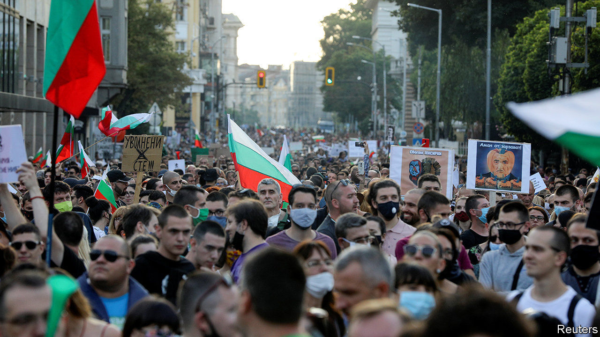

## Bullies on a beach

# A seaside-villa scandal sparks huge protests in Bulgaria

> Bodyguards who shoved an opposition politician could cost Boyko Borisov, the prime minister, his job

> Jul 23rd 2020SOFIA

ON JULY 7TH a small boat motored up to a villa near the Black Sea resort town of Burgas. On board (and livestreaming) was Hristo Ivanov, a former justice minister who leads “Yes Bulgaria”, an anti-corruption party. He wanted to show that the villa’s main resident, Ahmed Dogan, founder of a party representing the country’s ethnic Turkish minority, was illegally treating the beach as his own. (In Bulgaria, coastal beaches are public property.) Mr Ivanov alighted and planted a Bulgarian flag, to the consternation of several muscular men in sunglasses who, unmoved by the ex-minister’s protestations of his constitutional rights, pushed him into the water.

A few weeks on, it is Bulgaria’s government that risks being pushed over. Mr Dogan is seen as an ally of the prime minister, Boyko Borisov, a former bodyguard who dominates the political scene with a mix of populism and patronage. But multiple scandals have led to daily protests in Sofia by thousands of demonstrators. On July 23rd Mr Borisov announced he was sacking four of his ministers, hoping to fend off demands that he resign.

The government’s troubles started in June, when an anonymous source began leaking recordings of someone who sounded like Mr Borisov ridiculing EU officials and boasting of harassing a local business. The next week, photos surfaced of a man resembling the prime minister asleep on a bed, with a handgun on the nightstand and an open drawer full of €500 bills and gold ingots. Mr Borisov said the recordings and photos were manipulated, but acknowledged it was his bedroom.

Then came Mr Ivanov’s visit to Mr Dogan’s beach, which led to questions about the mysterious men who shoved him. On July 8th Rumen Radev, Bulgaria’s president, who was nominated by the opposition Socialists, revealed that they were officers of the state agency that protects senior officeholders. It was providing security for Mr Dogan and another member of his party: Delyan Peevski, a media oligarch. It was not clear why they deserved taxpayer-supplied beach bouncers, and Mr Radev called for the protection to be withdrawn.

The response was swift. On the morning of July 9th police raided the president’s office and detained two aides on charges of influence-peddling and disclosing state secrets. That afternoon demonstrators took to the streets, accusing the chief prosecutor of ordering the raid. By July 11th Mr Radev was saying Mr Borisov ran a “mafia government” and urging him to step down.

Mr Borisov’s term ends next spring, but he may not last that long. Axing his finance, economy, interior and culture ministers was meant to deflect blame, but it hardly suggests strength. Dimitar Bechev, a political scientist at the University of North Carolina, thinks he has lost control of the agenda: voters suspect he is beholden to Mr Dogan and Mr Peevski. But early elections would bring little relief. Apart from Mr Borisov’s conservative GERB party, only the Socialists are strong enough potentially to form a government. They are seen as little better than GERB on corruption, and are friendly towards Russia.

All this has made for a rough summer. Bulgaria handled the first stage of the covid-19 epidemic well, with a tough lockdown. Early this month the European Commission accepted its entry into the “waiting room” for adopting the euro. But covid-19 cases have begun to rise, and the scandals are a reminder of how little progress has been made against corruption. “The state of democracy, the state of the institutions and the quality of life have been going backwards rather than forwards,” says Ruzha Smilova, a political scientist at Sofia University. At least the weather at Mr Dogan’s villa has been marvellous. ■

## URL

https://www.economist.com/europe/2020/07/23/a-seaside-villa-scandal-sparks-huge-protests-in-bulgaria
