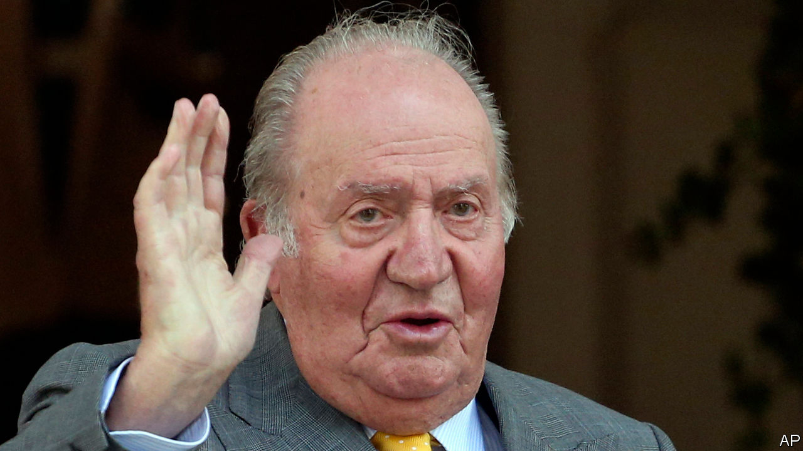

## A tarnished crown

# Spain’s King Felipe is distancing himself from his father

> Headlines about ex-king Juan Carlos’s finances and lovers embarrass the monarchy

> Jul 23rd 2020MADRID

BACK IN MARCH, as Spain was distracted by pandemic and lockdown, the royal household quietly announced that King Felipe had renounced his inheritance and cancelled the salary of €194,232 ($225,173) he was paying his father, Juan Carlos, who abdicated in 2014. The move was prompted by revelations that Felipe was a beneficiary of two foundations linked to Juan Carlos, both registered in tax havens. The Swiss bank account of one is alleged to have received a $100m payment from Saudi Arabia, of which €65m was transferred in 2012 to Corinna Larsen, Juan Carlos’s Danish ex-lover. (She claims this was “not to hide the money” but because he “hoped to win me back”.) Prosecutors in Switzerland and Spain are investigating. The Spanish press continues to publish leaked letters from Ms Larsen’s lawyers suggesting that she tried (and failed) to get Felipe involved.

Installed as monarch on the death of the dictator Francisco Franco, Juan Carlos was long respected for safeguarding Spain’s transition to democracy. He played a crucial role in quashing a coup in 1981. His clubbable manner concealed insecurities. Franco’s choice of him as king prompted a breach with his own, exiled, father. In his childhood “money was a matter of constant problems,” he told a friend. King Felipe grew up watching his father “collect lovers as if they were state gifts”, according to Lucía Méndez of El Mundo, a newspaper.

Juan Carlos’s fall from grace began in 2012, when he broke his hip while elephant-hunting with Ms Larsen in Botswana, revealing their relationship to the public. His level-headed successor, Felipe, has largely lived up to his promise of a “renovated monarchy for a new era”. He now faces the prospect of his father being charged, though as king emeritus Juan Carlos can be tried only in the Supreme Court, and the statute of limitations may save him. The left-wing coalition government has publicly nudged Felipe to chastise his father further, perhaps by evicting him from the Zarzuela Palace.

Ousted three times between 1808 and 1975, the Spanish Bourbons are still on probation. Republican sentiment is growing. “The monarchy isn’t doomed,” says Charles Powell of the Elcano Royal Institute, a think-tank. “But Juan Carlos is toxic and Felipe will struggle to win back the respect and confidence he had won. There’s very little sympathy for the institution now.”■

## URL

https://www.economist.com/europe/2020/07/23/spains-king-felipe-is-distancing-himself-from-his-father
