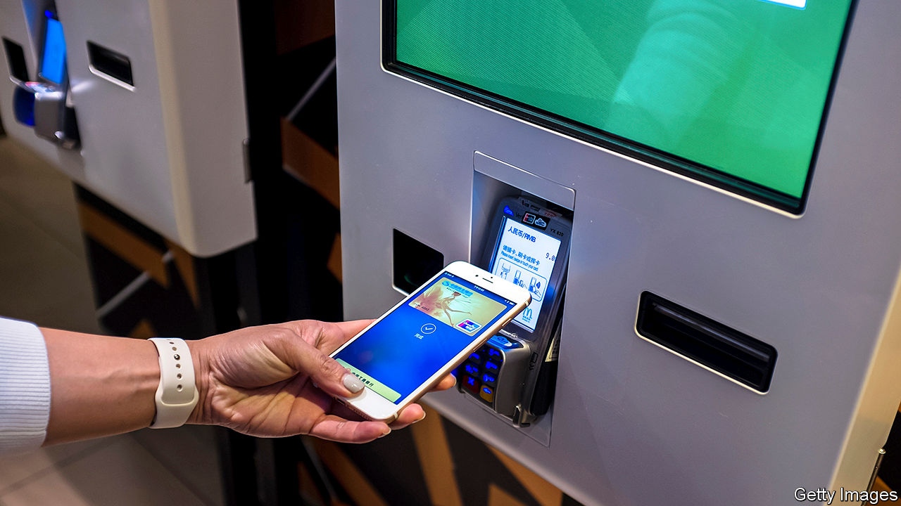
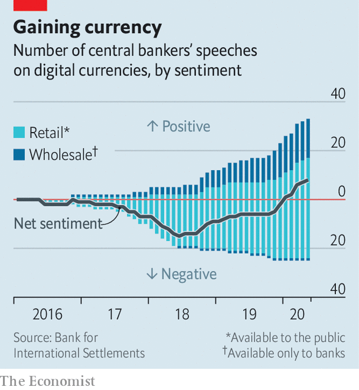

## Bips and bytes

# A shift from paper to virtual cash will empower central banks

> Officially issued digital currencies could help usher in negative interest rates

> Jul 23rd 2020SHANGHAI

AMERICA’S FEDERAL RESERVE recognised the disruptive potential of electronic money long ago. “This is a service which it is expected will be more and more availed of as the ease and economy of using it are understood,” its New York arm declared in a report. The year was 1917, and the Fed had just started allowing banks to transfer funds by telegram free of any interest charge. More than a century on, central banks are grappling with another technological revolution: the rise of mobile payments and the turn away from cash.

Just as in the early 20th century, when central banks created telegraph transfer networks, they are now coming to the view that they must design their own digital-payment networks in order to retain control of their monetary systems. One idea gaining favour is to issue a so-called central-bank digital currency (CBDC), which would exist only as electrons on a computer chip, rather than a coin or bill. Roughly 80% of central banks are doing some kind of CBDC work, from research to trials, according to one survey. Although still early, it is a trend that could give rise to tantalising new possibilities for monetary policy.

Most central bankers were sceptical about CBDCs at first, but in recent months their views have turned more positive, according to an analysis of their speeches by the Bank for International Settlements (BIS), a club of central banks (see chart). Partly, that is because they are now more familiar with the concept. China has already put the digital yuan into use on a limited test basis, and Sweden is close to that with the e-krona. The coronavirus pandemic has added to the urgency as more people shop online or pay with contactless cards or phones rather than cash.

The primary motivation for issuing a CBDC is likely to be defensive. The gradual demise of cash poses two basic risks. First, online-payment systems could fail, suffering outages or hacks. To safeguard the integrity of their currencies, central banks hope to offer fail-safe digital alternatives.

The second risk is that private-sector systems are too successful, with more people switching to payment platforms offered by big tech firms such as Facebook or Tencent. Many central banks began taking this risk more seriously when Facebook unveiled its plans for a digital currency in 2019. As Hyun Song Shin, head of research at the BIS, has put it, a shift towards such currencies would be like moving the economy from a town-square market—where all vendors happily accept cash—to competition between full-service department stores. Once popular enough, the department stores could stop you from shopping elsewhere and might also introduce new fees. Regulators could require private payment platforms to interconnect, but a well-designed CBDC would help ensure that this happens, by forming a digital bridge between different systems.

European central bankers are most exercised by the effects of a privately run digital currency on competition and the consumer interest. The Fed seems farther away from considering the idea, in part because Americans are keener on cash.

CBDCs also give central banks more control. They could allow for transactions to be easily tracked, perhaps making them more alluring to China’s authorities. In the West, where surveys show that the public cares more about privacy, CBDCs may need to ensure anonymity, without circumventing anti-money-laundering checks.

Where things get really interesting from a theoretical perspective are the implications for monetary policy. This is particularly the case if the new currencies are “retail” CBDCS, made available for use by the public. (A less exciting option would be to issue “wholesale” CBDCs exclusively to commercial banks, much as they already get funds from the central bank, albeit underpinned by whizzier technology.)

CBDCs may make it easier to implement negative interest rates. Unlike old-fashioned cash, digital fiat can be programmed. For now, rates cannot go too negative, because savers can always demand cash, which by definition offers an interest rate of zero. But if digital cash is programmed to have a negative interest rate, people would have fewer fallbacks and central banks more flexibility.

Central bankers might also be tempted by the potential for targeted interventions—much to the horror of those already worried about the clout of unelected monetary officials. Rather than lending to commercial banks, central banks would be able to top up individual currency accounts. During a downturn, they could transfer funds to those with low balances. After a natural disaster, they could direct support to affected areas. And they could offer consumption rebates depending on how and where the money is spent.

Yet these newfound powers would have drawbacks. For the CBDC to be a conduit for negative rates, countries would probably need to have eliminated cash, otherwise people could still opt for physical over virtual money. Moreover, if the CBDC does have a deeply negative interest rate, people might lose confidence in it. Savers could demand another currency or a different asset, such as gold. As for targeted interventions, there is a danger in programming too many special features into digital currencies. They would start to resemble securities with specific purposes, undermining the fungibility that has been a feature of money since the days of cowrie shells.

Central banks would also have to pay heed to new vulnerabilities. In the event of a panic, savers could convert their bank deposits into their CBDC accounts, adding to stresses on the financial system. Even without a panic, strong demand for CBDCs could chip away at banks’ deposit bases, making them more reliant on wholesale funding, which is often more costly and less stable. Some economists argue that limits on withdrawals and on issuance might help avoid some of these effects.

In any case, the policy ramifications are the stuff of monetary fiction for now. A more practical concern is whether central banks can succeed in building sturdy, easy-to-use CBDCs. The past few months have brought several examples of failures in public technology, from overwhelmed unemployment websites in America to an abandoned coronavirus-tracing app in Britain. No government wants to see its currency crash, even if only virtually. ■