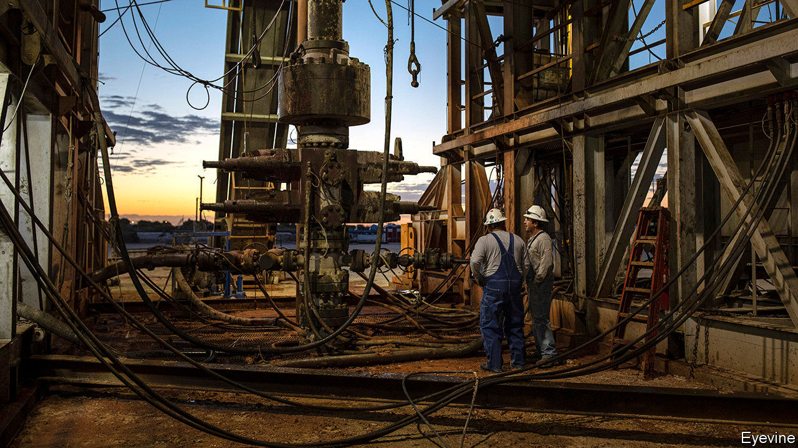
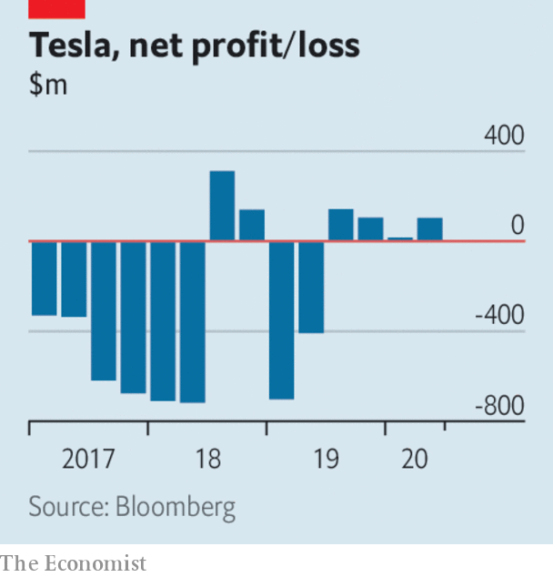

# Business this week

> Jul 23rd 2020

Chevron said it would acquire Noble Energy in a deal worth $13bn, the first big takeover in the oil industry since the coronavirus crisis rocked the market in March. Noble is an independent producer with substantial assets in the Permian basin, where Chevron is investing heavily in shale. More consolidation is expected among oil companies as they navigate an uncertain outlook of decreased energy demand.

Meanwhile, oil prices hit their highest level since early March, in a broader market rally that was in part a response to the EU’s stimulus agreement. Brent crude climbed towards $45 a barrel.

United Airlines described the latest quarter as the most financially difficult in its 94-year history. Revenues plunged by 87% from April to June compared with the same three months last year, pushing United to a net loss of $1.6bn. The carrier burnt through an average of $40m in cash a day, though it expects that to ease this quarter. See [article](https://www.economist.com//business/2020/07/25/america-inc-braces-for-an-earnings-bloodbath).

United joined Lufthansa, American Airlines and British Airways in calling for co-ordination in testing transatlantic passengers for covid-19. The airlines sent a letter to the White House and European Commission arguing that co-ordinated testing would remove impediments to travel, such as quarantine.

Intesa Sanpaolo, Italy’s second-biggest bank, improved its takeover proposal for UBI Banca, the fifth biggest. It is trying to entice UBI’s shareholders by increasing the cash element of its deal; its website is running a countdown to the offer’s expiration on July 28th. Intesa thinks a merger will help the banks cope better with “new complex scenarios” resulting from the pandemic.

Tesla’s sales stayed steady in the second quarter, bucking the trend of plunging revenues among carmakers, possibly helped by its controversial defiance of the lockdown to restart production. The company reported net income of $104m, marking the first time it has made a profit in four consecutive quarters. It also announced that its second car factory in America will be based near Austin, Texas.

Lockdowns took a toll on Coca-Cola’s sales, which plunged by 28% in the second quarter compared with the same three months last year, thought to be the steepest decline for the company in at least 25 years. The maker of soft drinks gets half its revenue from sales at cinemas, stadiums and other venues. It noted that it had performed better in places with less restrictive lockdown measures.

Adevinta, a Norwegian operator of digital marketplaces in 15 countries, agreed to buy eBay’s classified-ads business in a $9.2bn transaction. EBay Classifieds was a force on the web 25 years ago. It now counts Gumtree among its brands, but brings in just a tenth of eBay’s sales. Adevinta says that the combined entity will get 3bn monthly visits to its various websites.

Congress started hashing out another stimulus package. There is resistance from some Republicans towards extending the extra $600 a week in unemployment benefits that has been paid during the crisis. The higher level of benefit irks those who think it is a disincentive to work; Democrats argue that many families will fall into hardship without it. This is the last week that the additional $600 will be doled out to the jobless. See [article](https://www.economist.com//united-states/2020/07/22/americas-backwards-coronavirus-strategy). 

The Senate Banking Committee approved the nomination of Judy Shelton to the Fed (the full Senate must still vote). Donald Trump’s choice of Ms Shelton is controversial. She has argued against the existence of central banks, backed a return to the gold standard, and has been a serial switcher on interest rates. 

The Federal Reserve extended its “Main Street” lending-support programme for small and medium-sized businesses to organisations that work for no profit, such as hospitals, colleges and charities. 

Financial regulators in China took control of nine insurance companies, trust firms and stockbrokers, in a crackdown on alleged corporate wrongdoing and concern about risky bets amid a rally in China’s stockmarkets. Several of those seized, including Huaxia, a life insurer, are linked to Xiao Jianhua, a Chinese billionaire who was abducted from Hong Kong in 2017. It is thought he is awaiting trial in China.

Walmart’s nationwide policy requiring customers to wear face masks came into force. Most abided by the rules, though there were reports of a few differences of opinion being aired among patrons in some stores. Many of America’s retailers now insist on face coverings. Shoppers in England also debated the merits of masks, which are mandatory in shops from July 24th.

## URL

https://www.economist.com/the-world-this-week/2020/07/23/business-this-week
