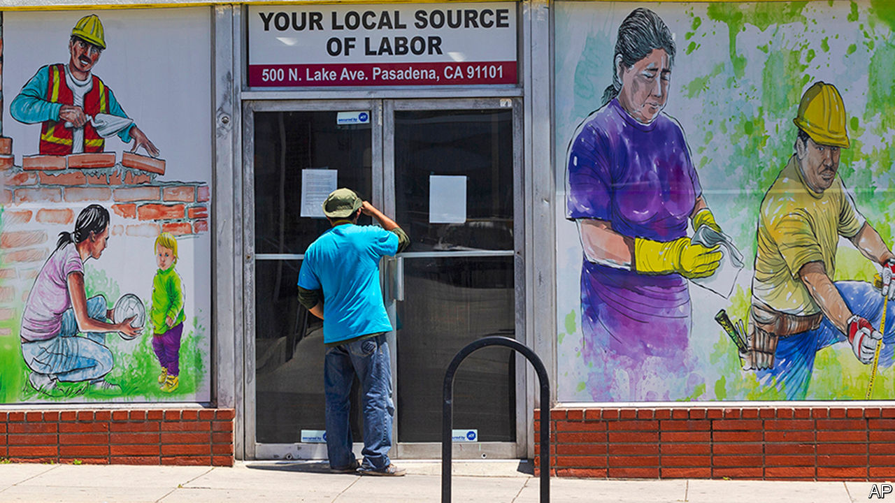

## One-handed economics

# Generous unemployment benefits are not keeping Americans from work

> Economists usually squabble over everything. On this, they are nearly unanimous

> Jul 23rd 2020

SINCE THE $2trn stimulus package was passed in March, America has temporarily had one of the world’s most generous unemployment-insurance (UI) systems. Some fear this comes at a steep price. With the unemployment rate still in double digits, are munificent state handouts stopping people from looking for new jobs or returning to old ones?

During the recession a decade ago, Robert Barro of Harvard University calculated that nearly a third of unemployment in 2010 was due to prolonged and more generous UI benefits. But if economists thought UI was generous then, they have seen nothing yet. Seven in ten of those on UI now receive benefits greater than their wages, studies suggest. One-fifth of those on benefits are receiving double what they previously made. If people can earn a dignified living from the state, why bother to seek work?

One reason is that for many Americans jobs are tied to health care and retirement programs. It makes no sense to turn down a job with potentially lifetime benefits to cash in a few more UI cheques. Many workers do not even have the option of doing so. Some states oblige employers to report employees who decline to return to work. Those workers’ benefits are stopped if the refusal to work is not due to health concerns.

So far there is little evidence to suggest that the extra $600 a week is slowing down the labour-market recovery. If bosses were struggling to fill positions, you might expect vacancies to be high. In fact the number of job vacancies in April was the lowest since 2014, at only 4.9m openings (though it has recovered somewhat since then). Homebase, a company that provides scheduling tools to businesses, tracks small hospitality and retail firms. Applicants per job doubled in early April, suggesting that laid-off workers were quick to look for something else.

Another signal that employers were struggling to fill positions would be soaring wages. Workers might hold bosses hostage with the threat of settling for benefits instead. Upon first inspection, this seems to be true. Average hourly earnings in the second quarter of 2020 increased by about 7% from a year ago, according to Goldman Sachs. However this is largely because low-paid workers have lost jobs in disproportionate numbers, dragging average wages upwards.

All of this implies that the main factor behind the high unemployment rate is lack of jobs, not an unwillingness to work. Economists normally fight like cats in a bag. But an astonishing 0% of those surveyed by researchers at the University of Chicago disagreed with the idea that “employment growth is currently constrained more by firms’ lack of interest in hiring than people’s willingness to work at prevailing wages.”

## URL

https://www.economist.com/united-states/2020/07/23/generous-unemployment-benefits-are-not-keeping-americans-from-work
