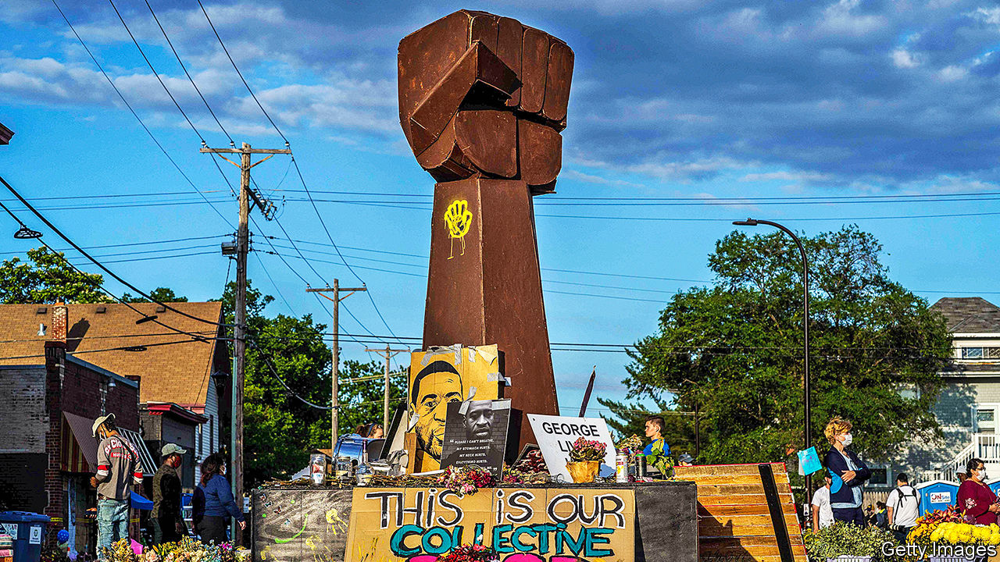

## Minnesota vice

# What is a police department for?

> Having decided to abolish its police department, Minneapolis does not know how to replace it

> Jul 25th 2020MINNEAPOLIS

THE INTERSECTION of 38th Street and Chicago Avenue has, since George Floyd was killed there on May 25th, become a shrine, pilgrimage destination and public-art exhibition. A huge raised fist surrounded by flowers stands at the intersection’s centre. “You Changed the World, George,” with sunflowers beneath and clouds above, is painted on the purple side of a squat building across the street. Amid all the expressions of grief and resolve stands an imperative: at the centre of a row of roses pinned to a clothesline, a laminated sheet of paper asks people to “Creatively imagine a world without police.” For two months, many in Minneapolis have been doing just that—and discovering just how wide the gulf between creative imagination and running a city is.

At a rally on June 6th Jacob Frey, Minneapolis’s mayor, was jeered after telling the crowd that he did not support abolishing the police department. At another rally the next afternoon in Powderhorn Park, not far from where Mr Floyd was killed, nine city councillors pledged to do just that. The city council voted unanimously to abolish the department later that month.

They have proposed amending the city’s charter to replace the police department with a “Department of Community Safety and Violence Prevention, which will have responsibility for public safety services prioritising a holistic, public health-oriented approach.” Their proposal also removes the mayor’s “complete power over the establishment, maintenance and command over the police department,” and gives the City Council shared oversight over the new department.

Their proposal is before the city’s Charter Commission (analogous to a constitutional court) for review, and the council wants it on the ballot in November. Even if it passes, state labour law could intrude. Public employers cannot “interfere with the existence of employee organisations,” such as a union. Abolishing the police department would presumably entail abolishing the union, and the union would presumably fight abolition in court.

Whether the plan has the appeal to pass remains unclear, but one thing almost everyone in the city agrees on is that the status quo is not working. Raeisha Williams, an activist and entrepreneur who ran for City Council in 2017, says that “there is a huge disproportion in how [African-Americans] are treated” by the city’s police force. Steven Belton, a lifelong Minnesotan who heads the Urban League Twin Cities, says that “standard operating procedure” among city police officers “assumes that African-Americans generally and black men in particular are hostile, dangerous and require maximum force and must be subdued for the most ordinary and mundane encounters with police.” Before George Floyd, there were Philando Castile, Jamar Clark and Christopher Burns, all black men killed by police in the Minneapolis area. Many black Minnesotans have stories about mistreatment by officers. Police abolitionists believe that systemic bias means that the force is beyond saving, and must be scrapped and reinvented.

Not everyone is so sure. Some object to the amendment’s vagueness about what comes next. Will there still be armed officers to respond to serious emergencies? How many? Not every mental-health crisis or overdose requires a heavily armed response, but what happens when an unarmed mental-health or addiction professional insists on an armed officer as backup? Currently, the police chief has to answer to the mayor. What happens when he has to answer to the mayor and 13 city councillors? Who makes the final decision? Where does the buck stop?

Others object to how replacing the police department was proposed. Nekima Levy Armstrong, a civil-rights lawyer and founder of the Racial Justice Network, an activist group, believes the councillors made their pledge “to pander to the crowd...They didn’t come to the black community to engage us.” She has pushed the city council for years to do something about the police department, to no avail, and they are now just “pretending to take action with regard to police accountability.”

Ms Levy Armstrong also argues that council has undermined Medaria Arradondo, the city’s current and first black police chief, who swiftly fired Derek Chauvin, the officer who killed Mr Floyd, and the three others with him—something few previous chiefs would have done. Unlike many big-city chiefs, who get poached from other departments, Mr Arradondo is a Minneapolis native who came up through the ranks. In 2007, while he was still a lieutenant, he sued the department for racial discrimination (the suit was settled out of court). Ms Williams—who like Ms Levy Armstrong supports reform but opposes the charter amendment—calls Mr Arradondo “our best hope...He treats us with humanity and dignity.”

Others worry about the effects on public safety. Brian Herron, the pastor of Zion Missionary Baptist Church in north Minneapolis, says the city council has “created a climate where people believe that the police have no power...That creates lawlessness.” And indeed Minneapolis has seen a jarring spike in gun violence since the protests began. “We’re not in Shangri-La where every issue is about people not having housing or opportunity,” Mr Herron explains. “We have to come to grips with the fact that people are committed and dedicated to this lifestyle. It’s a very small number, [but] none of the people pushing this will stand in front of the bullets.”■

## URL

https://www.economist.com/united-states/2020/07/25/what-is-a-police-department-for
