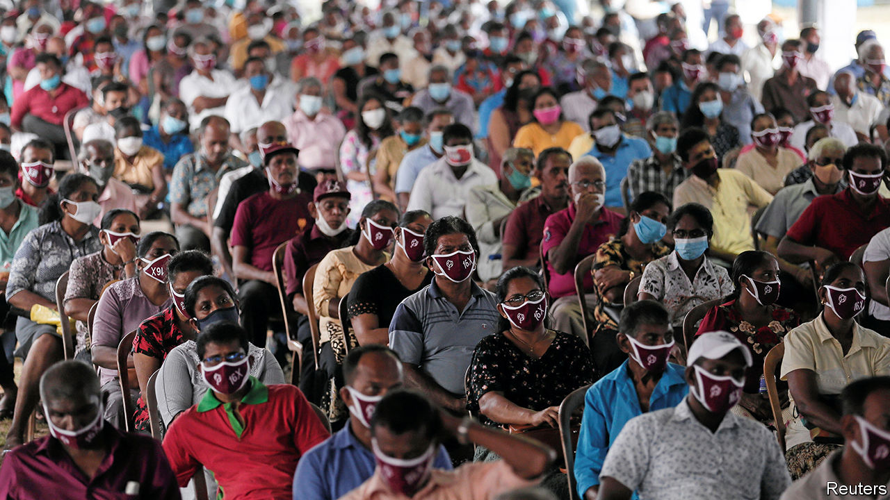

## Pax Rajapaksa

# An election in Sri Lanka will boost the Rajapaksa family

> They talk of making big changes to the island’s constitution

> Aug 1st 2020COLOMBO AND DELHI

ON THE EVE of an election, what might a political party wish for? A strong brand, an effective party machine, plenty of money, a sympathetic press and a charismatic leader? How about a rival that is tired and discredited after a lacklustre term in office, and has split into factions that hurl more mud at each other than at you?

Such are the advantages enjoyed by the Sri Lanka Podujana Peramuna (SLPP) as it coasts towards a general election on August 5th. The question is not whether it will win. It is whether votes alone will secure two-thirds of the 225 parliamentary seats, or whether the Rajapaksa family—a powerful political dynasty from the south of the island for which the SLPP is essentially a vehicle—will need to coax defectors from other parties to form a supermajority.

Either way, the stage is set for what might be called Sri Lanka’s Second Empire as the Rajapaksas, who ruled in regal fashion from 2005-15, resume unbridled control. They lost this five years ago when the present head of the clan, Mahinda Rajapaksa, then the president, narrowly failed to win a third successive term. During the hiatus, the coalition headed by the rival United National Party (UNP) changed the constitution to trim presidential powers, put in a two-term limit and strengthened independent oversight bodies such as a national election commission. 

The Rajapaksas launched a relentless comeback. The youngest brother, Basil Rajapaksa, stitched together the SLPP in 2016. By 2018 it had won big victories in local council elections. A year later another brother, Gotabaya, was elected president. He profited not only from a reputation built as the defence chief who, in 2009, brought a bloody insurgency of almost three decades by minority Tamils to a gory end, but also from the haplessness of the UNP government in the face of an attack by Islamist terrorists that killed more than 250 people on Easter Day in 2019. Gotabaya promptly appointed his brother Mahinda prime minister, at the head of a minority government.

The election is sure to strengthen the Rajapaksas’ hand. Should the SLPP win enough seats, it plans to rewrite Sri Lanka’s constitution. The present one “is like a building where the foundation was built for something else and lots of floors have been added later,” said Basil Rajapaksa recently. “One day that building will collapse and people will die.”

The constitution has its faults. But opposition parties and human-rights activists fear that the Rajapaksas will reconstruct it so as to guarantee their hold on power. The previous period of Rajapaksa rule was marred by the persecution of dissidents, the promotion of sectarian triumphalism, opaque financial dealings and a foreign policy of cozying up to dictatorships, particularly China.

So far in his presidency Gotabaya Rajapaksa has put army officers in control of things ranging from the printing of driving licences to a presidential task force empowered to “Build a Secure Country, Disciplined, Virtuous and Lawful Society”. Asked how he envisaged the SLPP as a ruling party, Basil Rajapaksa blithely responded that the Chinese Communist Party was an admirable model.

Unless a drubbing jolts the opposition into a wrenching overhaul, the Rajapaksas will face little challenge in the medium term. Of the two parties that dominated Sri Lankan politics for a generation, one has been largely absorbed into the SLPP as a junior partner and the other, the UNP, has withered under an old guard that failed to reform. Long allied with the UNP, parties representing minority Tamils and Muslims may now be forced into an accommodation with the Rajapaksas. 

This may be bad for pluralism, given the ruling family’s tendencies. But Sri Lanka, a relative success in measures of human development, is in a delicate state. Last year’s terror attacks wrecked two tourist seasons. Even as crushing foreign-debt repayments loomed, Gotabaya Rajapaksa slashed taxes, creating a 25% revenue shortfall. Now the pandemic has hammered tourism again. Remittances, the island’s other main source of income, have plummeted. Perhaps a period of political calm, even under the Rajapaksas, is what Sri Lanka needs. ■