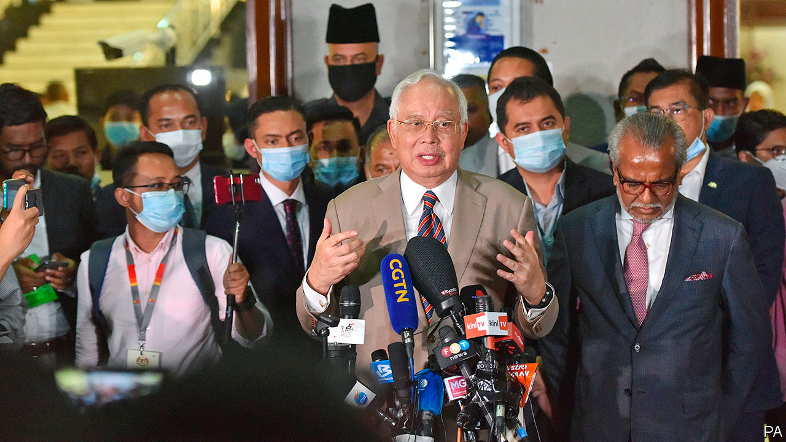

## Conviction politician

# Najib Razak is found guilty on seven charges in the 1MDB scandal

> Malaysia’s former prime minister gets a 12-year sentence. More verdicts loom

> Jul 30th 2020SINGAPORE

A PAINTING BY Monet and a superyacht. Diamond jewellery and a transparent piano. Many of the things that were bought with the $4.5bn that America’s Department of Justice says disappeared between 2009 and 2015 from 1MDB, a Malaysian sovereign-wealth fund, were rather flashy. The spree attracted investigations in at least six countries.

On July 28th a court in Malaysia convicted Najib Razak, the former prime minister who co-founded and chaired the fund, of seven charges of abuse of power, breach of trust and money-laundering relating to the scandal. The court sentenced him to 12 years in prison and fined him 210m ringgit ($49m). Mr Najib will remain free pending his appeals, which will probably drag on for months. The verdicts came days after Goldman Sachs reached a settlement with Malaysian authorities related to its underwriting of three bond-offerings that raised $6.5bn for 1MDB. The bank will hand over $3.9bn: it is paying $2.5bn in cash and promising to return at least $1.4bn in assets linked to the bonds.

The trial was the first of several facing Mr Najib, who denies wrongdoing. This one concerned payments totalling 42m ringgit made to him by SRC International, a former subsidiary of 1MDB. After hearing evidence for almost 16 months, the judge poured cold water on the argument that Mr Najib had been deceived by associates. He also questioned Mr Najib’s claim that he thought the money was a donation from Saudi royalty. He noted that the former prime minister never sent King Abdullah (who died in 2015) a note of thanks.

The verdicts arrive at a tumultuous time in Malaysian politics. When the scandal became public in 2015 it caused ructions within Mr Najib’s party, the United Malays National Organisation (UMNO). He fired Muhyiddin Yassin, his deputy prime minister, who was demanding an explanation of the affair. At a general election in 2018 voters ousted Mr Najib and UMNO, which had led every Malaysian government for 61 years. They gave power to a coalition called Pakatan Harapan. Its partners included Bersatu, a new party founded as an alternative to UMNO by Mr Muhyiddin and Mahathir Mohamad, another former prime minister.

Their government lasted 22 months before collapsing amid squabbles. Mr Muhyiddin and a group of renegades, including most members of Bersatu, broke away. They combined with UMNO and other parties to form a new coalition, Perikatan Nasional. This bloc now runs the country with Mr Muhyiddin as prime minister.

Relations between Perikatan Nasional’s constituent parties are lukewarm. UMNO and its ally PAS, an Islamic outfit, dominate. They resent Mr Muhyiddin’s leadership. In an apparent bid to keep them sweet, Mr Muhyiddin has created an unusual number of ministerial jobs and doled out roles at government-linked companies. Terence Gomez, a professor of political economy at the University of Malaya, says such appointments are irresponsible while the country is grappling with covid-19. He adds that Malaysia’s sprawling ecosystem of government-linked entities desperately needs reform. 1MDB itself emerged from within it.

Mr Najib was not widely expected to be convicted on all seven charges. Some of his backers could seek to make trouble within Perikatan Nasional. But other UMNO members may be chastened. That would benefit Mr Muhyiddin—as will the opportunity to make tough-sounding noises about corruption, which will please the public.

In the longer term, Mr Najib’s conviction may increase the chance of Mr Muhyiddin choosing to leave his newfangled party and returning to UMNO, four years after his confrontation with the former prime minister led to him being kicked out of it. This possibility is openly discussed by the party’s elites. It could save Bersatu and UMNO from scrapping for the same voters at any future election. It would be a remarkable turnaround if Mr Najib’s conviction were to end up helping his party prolong its time in power.■

## URL

https://www.economist.com/asia/2020/07/30/najib-razak-is-found-guilty-on-seven-charges-in-the-1mdb-scandal
