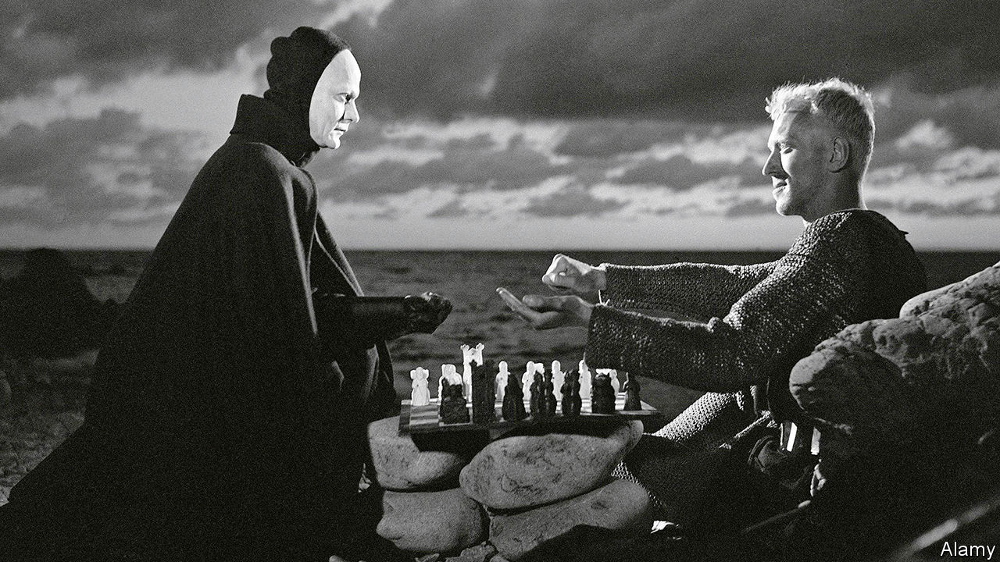

## Home Entertainment

# Ingmar Bergman’s contemplation of plague and death is life-enhancing

> “The Seventh Seal” might seem dauntingly sombre. But it has a lighter side

> Aug 1st 2020

THE INSPIRATION for one of the most legendary (and parodied) images in world cinema lies a half-hour’s drive north of Stockholm, up near the ceiling of a small medieval church. A fresco shows a ghoulish skeleton and a young man, dressed in a green robe and a brown hat, hovering over a large chessboard. The mural at the Taby church was painted in the 1480s. It came to life nearly five centuries later, when it led Ingmar Bergman, the Swedish director, to cast Max von Sydow as Antonius Block, a troubled knight, and to pit him against Death in a chess match.

Death is everywhere in Bergman’s “The Seventh Seal”. It rages in the Holy Land, where Block and his squire Jons have spent years as Crusaders, and back home in Sweden, where the bubonic plague has started to spread. Before it takes him, Block wants to understand whether his life has made any sense, and what might await in the hereafter. To do so he needs time, and to have time he needs to play for it.

Between the chess game to which Block challenges the grim reaper, the ethereal expression fixed on his face throughout the film, and the backdrop of disease, “The Seventh Seal” can seem unbearably heavy, especially during today’s pandemic. Block cannot come to terms with God’s silence. He yearns to have faith in faith, and not in the facile kind either. He scoffs at the monks who claim that the plague is divine punishment, and pities the penitent zealots, with their crosses and relics, whipping themselves senseless with scourges. He meets a young girl accused of being possessed by the devil and soon to be burned at the stake, and stares into her eyes, looking for some greater truth. He finds none. “Faith is a torment,” he says. “It is like loving someone who is out there in the darkness but never appears, no matter how loudly you call.”

But there is a lighter, earthly side to “The Seventh Seal”, in the form of Block’s sidekick, Jons, who thinks of faith as less a torment than a waste of time. “He grins at Death, mocks the Lord, laughs at himself and leers at the girls,” Jons says of himself. “His world is a Jons-world, believable only to himself, ridiculous to all including himself, meaningless to Heaven and of no interest to Hell.”

Jons goes into a church, much like the one Bergman entered in Taby, where he finds a painter putting the last touches to a grisly mural, the “Dance of Death”. What, he wonders, is the point of scaring people like that? To make them think, answers the painter. And if they think, Jons says, they get more scared, and run to religion for solace. Jons and the painter run to a barrel of brandy instead, and get roaringly drunk.

The struggle between man and death is always one-sided, and largely pointless. The chess game is rigged. Von Sydow died earlier this year, Bergman in 2007. Yet as he, the son of a pastor, suggests in “The Seventh Seal”, salvation may await not in the next world, but in this one. ■

Editor’s note: Some of our covid-19 coverage is free for readers of The Economist Today, our daily [newsletter](https://www.economist.com/https://my.economist.com/user#newsletter). For more stories and our pandemic tracker, see our [hub](https://www.economist.com//news/2020/03/11/the-economists-coverage-of-the-coronavirus)

## URL

https://www.economist.com/books-and-arts/2020/08/01/ingmar-bergmans-contemplation-of-plague-and-death-is-life-enhancing
