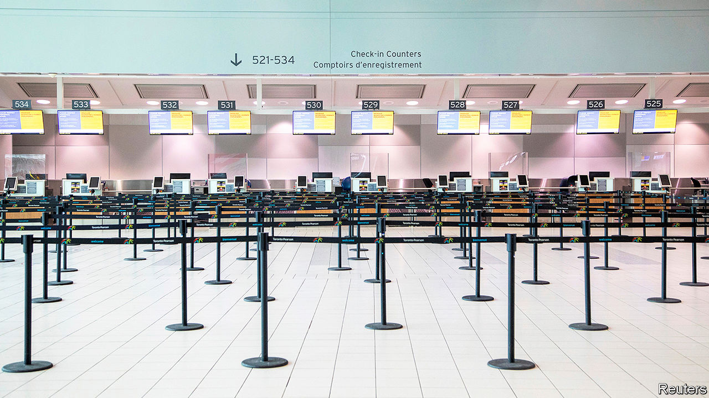
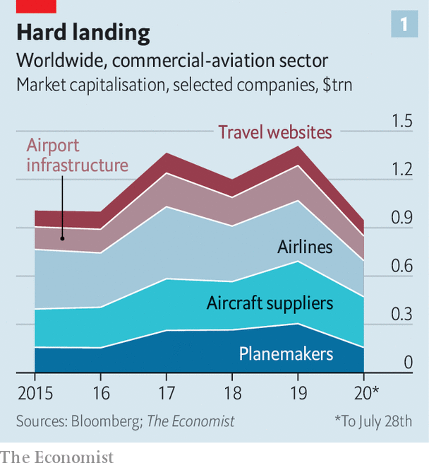
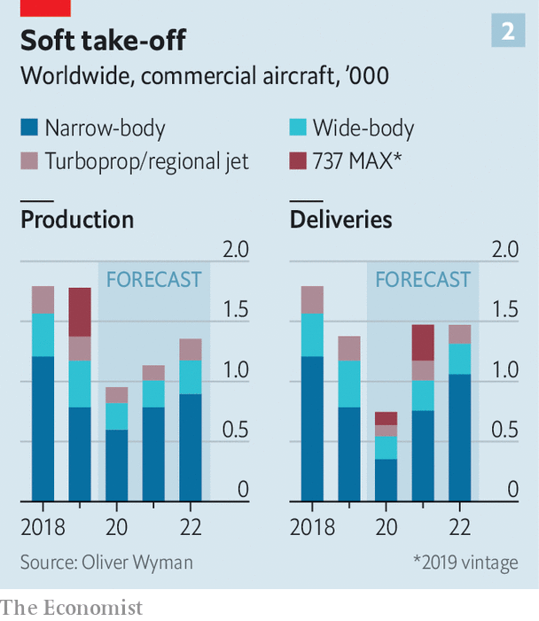

## Terminal conditions

# Air travel’s sudden collapse will reshape a trillion-dollar industry

> The pandemic has knocked the airline-industrial complex harder than it has most sectors

> Aug 1st 2020

LIKE MOST international jamborees these days the Farnborough air show wrapped up on July 24th as a virtual event. Webinars featuring grim-faced executives were not as entertaining as noisy acrobatic displays by fighter jets. But commercial aviation’s most important showcase at least marked a point when heads began to turn away from the devastation wrought by covid-19 and towards what comes next.

As airlines sell fewer tickets, owing to pandemic travel restrictions or travellers’ fear of infection, the industry that makes flying possible faces a reckoning. Aircraft-makers will make fewer passenger jets and so need fewer parts from their suppliers. Ticket-sellers will see less custom and airport operators, lower footfall. Many firms have cut output and laid off thousands of workers. The question now is how far they will fall, how quickly they can recover, and what will be the long-lasting effects.

The airline-industrial complex is vast. Last year 4.5bn passengers buckled up for take-off. Over 100,000 commercial flights a day filled the skies. These journeys supported 10m jobs directly, according to the Air Transport Action Group, a trade body: 6m at airports, including staff of shops and cafés, luggage handlers, cooks of in-flight meals and the like; 2.7m airline workers; and 1.2m people in planemaking. In 2019 they helped generate revenues of $170bn for the world’s airports and $838bn for airlines. Airbus and Boeing, the duopoly atop the aircraft supply chain, had sales of $100bn between them. For the aerospace industry as a whole they were perhaps $600bn. Add travel firms like Booking Holdings, Expedia and Trip.com, and you get annual revenues of some $1.3trn in normal times for listed firms alone, supporting roughly as much in market capitalisation before covid-19—and rising.

Instead, the coronavirus has lopped $460bn from this market value (see chart 1). Airline bosses are reassessing trends in passenger numbers, which had been expected to double in the next 15 years, just as they had with metronomic regularity since 1988, despite blips after the 9/11 terrorist attacks of 2001 and the financial crisis of 2007-09. Rather than increase by 4% this year, air-transport revenues will fall by 50%, to $419bn. After ten years of unusual profitability the $100bn of total losses forecast for the next two years is equal to half the nominal net profits the industry raked in since the second world war, calculates Aviation Strategy, a consultancy. Luis Felipe de Oliveira, director-general of ACI World, which represents the world’s airports, gloomily predicts that revenues there will fall by 57% in 2020.

Despite signs of life, particularly on domestic routes in large markets like America, Europe and China, the outlook remains uncertain. The wide-body jets used for long-haul flights stand idle. Carriers that rely on business passengers and hub airports are struggling. Although some American airlines expect a return to near-full operation next year, a second wave of covid-19 could dash these hopes. A small outbreak in Beijing in June set back the recovery in Chinese domestic flights. As one senior aerospace executive says, “It’s hardest to talk about the next 12 months.”

According to Cirium, another consultancy, around 35% of the global fleet of around 25,000 aircraft is still parked—less than the two-thirds at the height of the crisis in April but still terrible. Even if traffic recovers to 80% of last year’s levels in 2021, as some optimists expect, plenty of aeroplanes will remain on the ground. Citigroup, a bank, forecasts excess capacity of 4,000 aircraft in 18 months’ time.

Aircraft-makers, which had been preparing to crank up production, are forced to do the opposite. Airbus, with a backlog of more than 6,100 orders for its A320 jets, was rumoured to be raising output from 60 of the popular narrow-bodies a month to 70. Instead it is making 40. Its long-haul planes have suffered similar declines. Boeing’s situation is made worse by the protracted grounding in 2019 of its 737 MAX, a rival to the A320, in the wake of two fatal crashes. It has kept making the aircraft and hopes to have it recertified for flight later this year. The American firm will slowly increase production to 31 a month by the start of 2022. But like Airbus, it too has announced cuts to wide-body production.

This will open a big gap between what the pair, along with Embraer and Bombardier, makers of smaller regional jets, hoped to sell and what they actually will (see chart 2). According to consultants at Oliver Wyman, by 2030 the global fleet will be 12% smaller than if growth had continued unabated. That amounts to 4,700 fewer planes, which could translate to $300bn or so in forgone revenue for Boeing and Airbus, according to a rough calculation by The Economist.

With so many aircraft sitting idle and balance-sheets in tatters, airlines are getting rid of planes. Even low fuel prices will not save older, thirstier models. Four-engine wide-bodies are all but finished. On July 17th British Airways (BA) said it would retire all 31 of its Boeing 747 jumbo jets. IBA, an aviation-research firm, expects 800 planes around the world to be retired early.

Not all orders will dry up. Airlines, as well as leasing firms, which now own close to half the global fleet, are contractually obliged to take aircraft on order. Many buyers will have made pre-delivery payments of up to 40% of the price. Airbus and Boeing are, to varying degrees, pushing customers to take deliveries. Most negotiations have centred on deferring deliveries. EasyJet, a British low-cost carrier, has pushed back delivery of 24 Airbuses by five years. At Boeing, delays related to the problems of the 737 MAX allow airlines to ask for refunds. More assertively, Airbus’s boss, Guillaume Faury, does not rule out suing customers who renege on their orders.

A stock of “white tails”, as unsold planes are known in industry vernacular, may be the price to pay for protecting a supply chain that had been investing heavily for ever-higher production rates. Airbus will make 630 planes this year but deliver only 500, Citigroup reckons. It has the balance-sheet to carry inventory, thinks Sandy Morris of Jefferies, another bank. The new rate will preserve jobs and industrial efficiency, and make an eventual ramp-up easier.

Even this artificially high production will struggle to sustain the planemakers’ supply chain, however. This comprises manufacturers of engines (like Rolls-Royce and GE), producers of fuselages and other parts (such as Spirit AeroSystems), specialised materials firms (Hexcel and Woodward) and companies that produce avionics and electrical systems (including Honeywell and Safran). And that is not counting their myriad smaller suppliers; Boeing’s MAX supply chain stretches to around 600 firms. Many had invested heavily before the crisis, expecting strong demand. Defence contracts, which firms from Airbus and Boeing down are involved in and which covid-19 has not really affected, provide only partial respite. On July 29th Boeing said it had delivered just 20 planes in the second quarter, down from 90 a year ago, and that commercial-aircraft revenues had dropped by 65%, to $1.6bn. The next day Airbus and Safran also disclosed sharp falls in revenue.

The engine-makers provide a case in point. Besides lower demand for their kit—Rolls-Royce was gearing up to supply 500 units a year to Airbus but will now probably make 250—they face a collapsing aftermarket for spares and fewer overhauls, points out David Stewart of Oliver Wyman. Airlines with in-house maintenance divisions can scavenge parts or whole engines from grounded planes. Rolls-Royce, whose engines power two-fifths of all long-haul jets, has suspended dividends, said it would cut 9,000 jobs and taken a £2bn ($2.6bn) loan. It may have to ask investors for another £2bn. GE’s second-quarter revenues from its aviation business fell by 44%, year on year, dragging down the conglomerate’s overall results (see [article](https://www.economist.com//business/2020/08/01/a-ge-whodunnit)).

At the other end of the air-travel industry are airports. About 60% of their revenues comes from charges on airlines and passengers, and the rest from things like retail and parking. All are taking a hit. Airport shops and restaurants in America will lose $3.4bn between now and the end of 2021, forecasts the Airport Restaurant & Retail Association. As Mr de Oliveira of ACI World notes, two in three airports were losing money before the crisis; now all are. Some smaller ones may close if subsidies to support tourism from regional and national governments start to dwindle. Outside America commercial operators have not been treated by governments as generously as airlines have.

In July Standard & Poor’s again downgraded the debt of four European airports, including Amsterdam’s Schiphol and Zurich, and placed London Gatwick and Rome on watch, questioning their ability to raise charges while airlines continue to bleed cash. The rating agency estimates a cut of €10bn ($11.8bn) in planned capital spending by European airports in 2020-23, which may crimp efforts to install contactless technology that could help reassure travellers that terminals are safe to re-enter.

As dark as the skies have grown for the air-travel complex, there are some opportunities. Airlines are restructuring. Europe’s big legacy carriers, under pressure from low-cost rivals, are slashing costs. BA has suspended 30,000 workers and wants to rehire them on less generous terms. Bankruptcies and cutbacks will leave gaps in the market, aircraft are cheap, once-scarce pilots are plentiful, and airports will have spare slots, if they are allowed to redistribute them.

Strong challenger carriers have a chance to gain market share. Wizz Air, a Hungarian low-cost carrier, hopes to add capacity by March; its main markets in central and eastern Europe have been hurt less by the pandemic than those elsewhere, its customers are generally young and less worried about getting on a plane, and two-thirds of demand is related to visiting family and friends, which seems more resilient to covid-19 than business travel is.

Some carriers may radically rethink their financial structures, which could help leasing grow even faster. Domhnal Slattery, boss of Avolon, a big lessor, thinks that heavy debts airlines incur to survive the pandemic may convince many of them that they need not own aircraft but should instead concentrate on sales and marketing, just as hotel chains have turned their backs on owning property.

The industry is also rethinking its environmental footprint. Bolder airlines with stronger balance-sheets may use the crisis to renew their fleets, making them greener. They have bargaining power: everything is negotiable, including deferrals, prepayments and price.

Warren East, boss of Rolls-Royce, suspects that the “pre-covid call for sustainability will come back stronger than ever”. Airbus is still committed to the journey to zero-emissions flying, Mr Faury says; he sees it as an opportunity. Boeing would have to respond to stay competitive. European governments in particular regard it as a priority. France’s €15bn aid package for its aerospace sector includes a €1.5bn research-and-development fund to help Airbus launch a zero-emissions short-haul passenger jet by 2035 (probably powered by either biofuels or hydrogen). Mr Faury accepts that there is less money to invest. But also, he says, “more need”. The crisis has led to greater collaboration with suppliers that could make innovation “faster, leaner and cheaper” (though that has meant laying off 15,000 workers).

China, desperate to become a power in commercial aerospace, may see the disruption as a way to speed up entry into the global market, says Robert Spingarn of Credit Suisse, a bank. He speculates that Brazil’s Embraer, whose merger with Boeing fell apart in April, might collaborate with China’s COMAC to build a plane capable of competing against Airbus and Boeing. The Brazilians could supply the industrial knowhow and the Chinese the industrial might.

To the masked passengers on half-empty planes, boarded from ghost-town airports of shuttered shops, it may seem that the experience of flying will never be the same again. Yet aviation has bounced back before. It is likely to do so again—and may change for the better in the process. ■

Editor’s note: Some of our covid-19 coverage is free for readers of The Economist Today, our daily [newsletter](https://www.economist.com/https://my.economist.com/user#newsletter). For more stories and our pandemic tracker, see our [hub](https://www.economist.com//news/2020/03/11/the-economists-coverage-of-the-coronavirus)