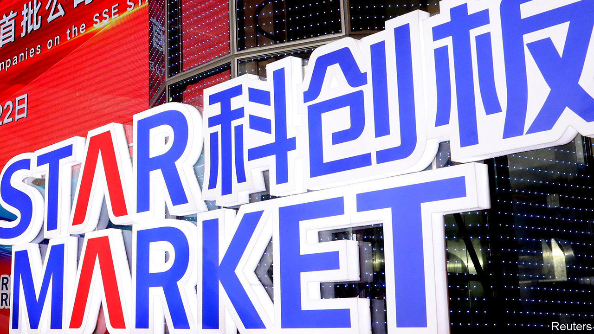
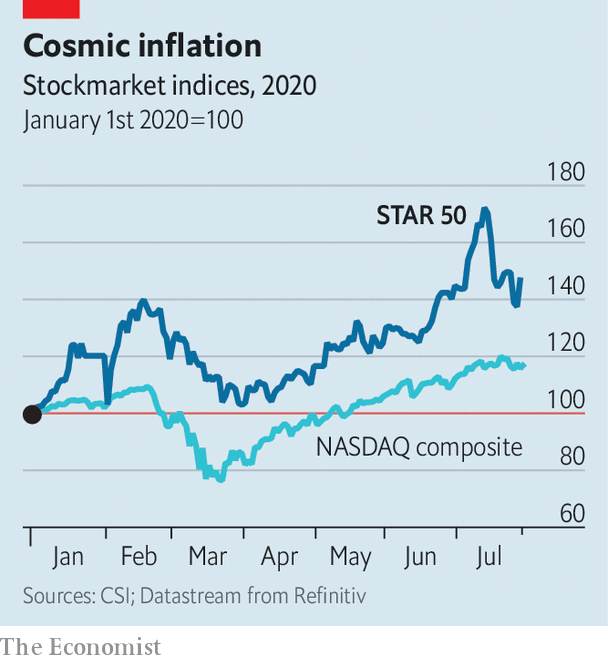

## Wish upon a STAR

# Why China’s answer to Nasdaq is going gangbusters

> Shanghai’s tech-focused STAR Market is benefiting from Sino-American tensions

> Aug 1st 2020

TO SEE THE world of technology shift before your eyes, look at the short history of the Shanghai Stock Exchange Science and Technology Innovation Board. China’s president, Xi Jinping, unveiled plans for the new exchange, modelled on New York’s Nasdaq and known as the STAR Market, in November 2018. It was to be a freer route to capital markets for Chinese tech firms. It opened in July 2019 with 25 companies and rocketing valuations. A year later, on July 23rd, the exchange launched an index of its 50 biggest companies.

A few months ago most people had never heard of the STAR Market or its firms. The most valuable was AMEC, a low-key Chinese manufacturer of chipmaking tools with a market capitalisation of around 100bn yuan ($14bn). Other big members, which make semiconductors (Montage Technology), office software (Kingsoft) or railway electronics (China Railway Signal & Communication), were mostly anonymous to Western ears.

That all changed in July. First, Semiconductor Manufacturing International Corporation (SMIC) listed its shares on the board, raising $6.5bn from the offering. A week later Ant Group, the payments arm of Alibaba, China’s e-commerce titan, said it would also list shares there (as well as in Hong Kong). Ant may be the most valuable private company on Earth, valued at $150bn or so. That flotation alone could push the STAR Market past the Nasdaq as the world’s top venue for tech capital-raising this year. And Ant isn’t alone. Geely, a big Chinese carmaker; the fintech arm of JD.com, an online retailer; Imagination Technologies, a British chip designer with Chinese investors: all are reportedly mulling listings. The bourse already hosts 141 firms. Another 409 are in the process of registering.

The STAR Market’s most eye-popping valuations are for companies whose products are central to the Chinese government’s desire for an independent domestic semiconductor industry. Shares of SMIC and AMEC, for instance, trade at 200 and 500 times earnings. The average price-to-earnings ratio of STAR 50 firms is a juicy 71, compared with 52 for Nasdaq.

By all technical accounts that looks rich. Experts consider SMIC and AMEC to be behind cutting-edge Western rivals. So how did the STAR Market come from nowhere to become the world’s largest money pile for tech in just a year?

The short answer is the tussle for technological and economic supremacy between America and China. SMIC delisted from the New York Stock Exchange last year, ostensibly for administrative reasons—but looming American legislation that could bar Chinese companies from American exchanges may well have weighed on its decision, too. An investment in the likes of SMIC or AMEC is, in other words, a wager that Beijing’s ambition of semiconductor independence is realistic—and that the Communist Party will not allow its champions to fail, even if they could not match high-end global competition. Judging by the STAR 50 index, up by nearly 50% so far this year (see chart), plenty of investors like those odds. ■

## URL

https://www.economist.com/business/2020/08/01/why-chinas-answer-to-nasdaq-is-going-gangbusters
