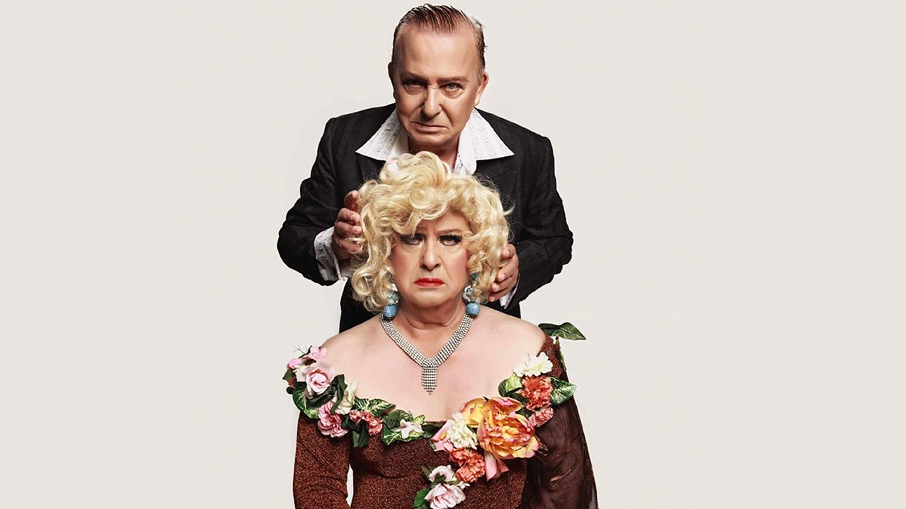

## The queen is dead

# Turkey mourns a revered drag artist

> But the government is more censorious than it was

> Aug 1st 2020ISTANBUL

HE WAS DEVOUT as a teenager and irreverent as an adult, but always kind, and bequeathed his fortune to charity. She was large, loud, and in her own words ugly to others but beautiful to herself with her blonde wig, improbable breasts and a tongue as sharp as a nettle. He was Seyfi Dursunoglu, a bureaucrat. She was the Grumpy Virgin, the persona he began to inhabit in the 1970s, in small clubs at first and then on national TV, on her way to becoming Turkey’s most beloved drag queen. They were one and the same person, and died on July 17th, at the age of 87.

Being gay or trans in Muslim-majority Turkey has always been hard. But homophobia has now become policy. Over the past month alone, Turkey’s president, Recep Tayyip Erdogan, called the LGBT movement a “cursed perversion” and an attempt “to poison young minds”, while his officials forced Netflix to cancel a new show because it featured a gay character and mused about withdrawing from a convention on violence against women because it contained references to sexual minorities.

The paradox is that many of Turkey’s most famous singers and entertainers have been gay or trans. Some of them still appear on TV. Mainstream culture in Turkey continues to welcome gay celebrities, so long as they do not discuss their sexuality openly.

The Grumpy Virgin outlasted a dozen prime ministers. But as Turkey’s politics have turned more Islamic and more inward under Mr Erdogan, she seemingly failed to keep up with the times. In 2007 the media watchdog banished her from the airwaves. Turkish TV shows these days are increasingly populated by Ottoman warriors and army commandos, and news programmes by martyrs, traitors and terrorists. Male ministers with long faces regularly vow to protect the nation from foreign plots. Turkey, it seems, is fast losing touch with its feminine side.

## URL

https://www.economist.com/europe/2020/08/01/turkey-mourns-a-revered-drag-artist
