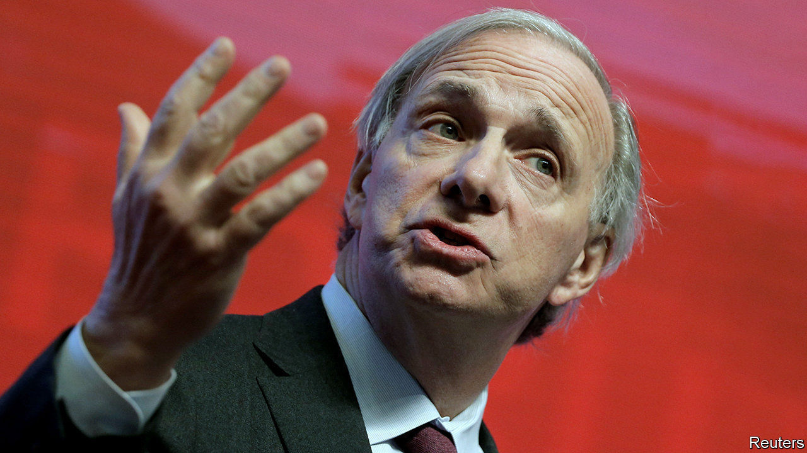

## Troubled waters

# Bridgewater faces losses and a lawsuit

> The most successful hedge-fund firm of all time hits a rough patch

> Aug 1st 2020NEW YORK

“WE’VE MADE more money for our clients than any other hedge fund in existence,” declared Ray Dalio, the founder of Bridgewater Associates, the world’s largest hedge-fund manager, in 2017. In early 2020 Bridgewater was head and shoulders above the rest, having made $58.5bn, net of fees, for its clients since the firm’s inception in 1975. Mr Dalio is worth $17bn, making him one of the richest people in the world. He stepped back from running the firm in 2017, but it has been shaped by his deep economic analysis, and his unorthodox management style, which he calls “radical transparency”.

In recent months, though, Bridgewater’s performance has suffered, and questions have been raised about how transparent its management really is. Start with its performance, which has struggled during the pandemic. The firm has two main types of funds: “pure alpha”, which makes active bets based on its predictions for the economy, and “all weather”, where holdings of stocks and bonds are based on their underlying volatility. The latter strategy lost around 7% in the first quarter. The pure-alpha funds fared even worse. In mid-March Mr Dalio said they were down between 7% and 21% since the start of the year. According to reports, they subsequently recovered a bit, with losses pared by June, but were still significantly down on the year.

That is in contrast to the performance of many other “macro” hedge funds. According to Preqin, a data provider, these made small positive returns, of 1.4% on average, in the first half of the year.

As a result of its losses, and investors pulling their money out of its funds, Bridgewater’s assets under management have fallen—from $163bn at the end of February to $138bn at the end of April.

The all-weather funds have low, fixed management costs and no performance fees. So it is the performance of pure alpha that largely determines Bridgewater’s overall financial health. That might explain why the firm is retrenching. Even as many businesses have laid off workers during the pandemic, few hedge funds are thought to have done so. But on July 24th the Wall Street Journal reported that Bridgewater had shed several dozen employees across its research, client-services and recruitment teams, out of a reported headcount of around 1,500 employees. Most of its incoming graduate investment analysts have had their start dates pushed back a year.

Bridgewater has also become engaged in a public spat with its former co-chief executive, Eileen Murray, who left in March. She has since alleged that the firm discriminated against her and claims it offered her a smaller exit package than those offered to male peers. In response, the firm is seeking to withhold deferred compensation, worth between $20m and $100m, from Ms Murray. It claims that, by speaking publicly about her allegations, she may have violated the confidentiality terms of her contract. On July 24th Ms Murray filed a lawsuit in Connecticut saying that she had followed, and would continue to respect, the rules on the disclosure of the firm’s confidential information and trade secrets. In court documents she claimed that the firm was using a “bad faith assertion” to avoid paying her deferred compensation, “as part of a cynical plan to intimidate and silence” her.

Even hedge funds with clever managers and successful long-term strategies stumble occasionally. Many stage a speedy recovery. As the number of covid-19 cases in America rises, the economy continues to wobble and the spat with Ms Murray escalates, though, Bridgewater’s troubles may continue to mount. ■

## URL

https://www.economist.com/finance-and-economics/2020/08/01/bridgewater-faces-losses-and-a-lawsuit
