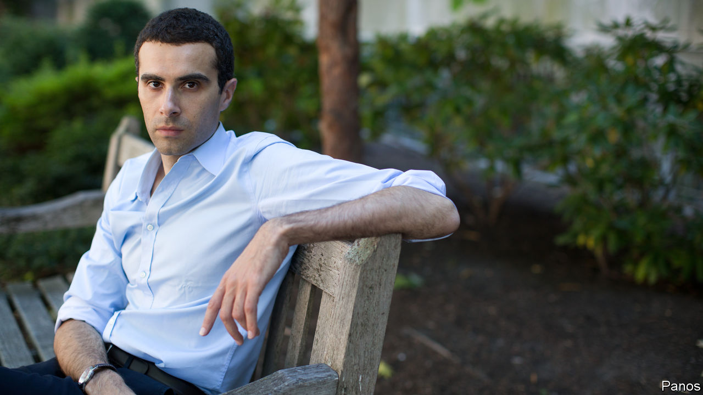

## A lost asset

# Emmanuel Farhi has died at the age of 41

> The economist was one of the brightest minds of his generation

> Jul 30th 2020WASHINGTON, DC

EMMANUEL FARHI showed a lot of promise in a lot of fields. At 16 he won a national physics competition in France. In the test to enter its most prestigious engineering school, he received the highest mark. After considering a career in maths, he settled on economics, where he flourished. “He was one of the greatest economic minds of his generation,” says Xavier Gabaix, a colleague at Harvard University. But on July 23rd that career was cut short when Mr Farhi died unexpectedly at the age of 41.

His research interests were unusually broad, covering competition, international macroeconomics, tax and productivity. The common thread was a motivation to help policymakers understand the world. With Mr Gabaix, Mr Farhi considered how to design taxes when people are not as rational as economists typically assume. Carbon taxes are thought to be a way of forcing consumers to bear the environmental costs of their choices. But if future fuel consumption is not on people’s minds when they shop for cars, such a tax may not work, and rules that limit emissions would be better. In research with David Baqaee of the University of California, Los Angeles, he studied the sources of productivity growth, and showed that ignoring firm-level differences could obscure the overall picture.

Mr Farhi’s most-cited work was on safe assets, written in 2008 with Ricardo Caballero of the Massachusetts Institute of Technology and Pierre-Olivier Gourinchas of the University of California, Berkeley. They argued that the global demand for safe assets had outpaced supply over recent decades. America’s economic and political might made it well-placed to service this savings glut. As a result, its current-account deficit had bulged, and its assets accounted for a bigger slice of global portfolios.

That paper spawned more research on how the world was stuck in a “safety trap”. Demand for havens had led to an appetite for pseudo-safe assets, such as packaged subprime loans. But these were soon revealed to be far from safe. And, after the debt crisis of 2010-12, investors realised that sovereign bonds in the euro zone were wobbly. The result was a severe global shortage of safe assets. Interest rates fell but, having fallen to around zero, could not decline further. The result was that interest rates for households and firms were, in effect, too high—and, in turn, their consumption and investment too low.

Mr Farhi saw America’s role as the world’s banker as unsustainable. If it produced too few safe assets then, with interest rates unable to adjust fully, global aggregate demand would stay depressed. But if it tried to keep up with investors’ demand for safety, its ability to repay its debts might one day be called into question. Speaking to the Richmond Federal Reserve in 2019, he noted America’s shrinking share of the global economy and worried that its role was becoming too much to bear.

One solution would be for other issuers of safe assets, such as the European Union or China, to emerge—though in a paper with Matteo Maggiori of Harvard, Mr Farhi warned that the transition could be messy. For now, investors doubting the safety of American government bonds had few other places to park their cash. But as alternatives became available, Treasuries would become much more vulnerable to self-fulfilling crises. The dominance of the dollar would be challenged, said Mr Farhi in 2019, though “you have to take the long view here and think about the next decades, not the next five years”. The tragedy is that he did not live long enough to test the prediction.