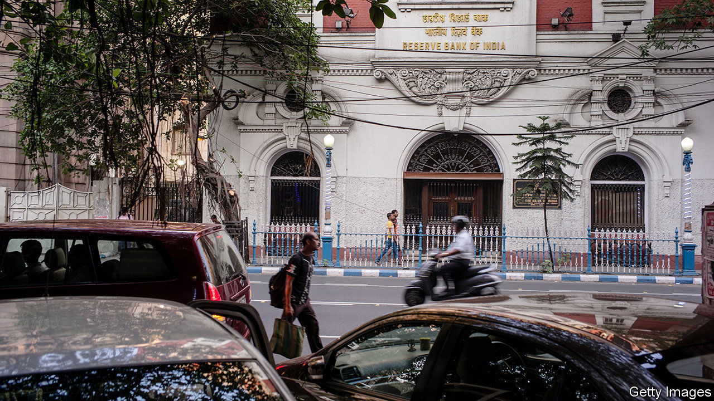

## Pain deferred

# Has India’s moratorium on loan payments delayed the pain for banks?

> It has shielded borrowers; but some banks may struggle once defaults are realised

> Aug 1st 2020

SOON AFTER India went into a strict lockdown in March, its central bank allowed borrowers to put off loan repayments for three months. That moratorium has since been extended by a further three months, and another extension is reportedly being considered. It appears to have been a boon to borrowers. But top financiers, such as Deepak Parekh, the chairman of HDFC, a big mortgage lender, and Uday Kotak, the chief executive of Kotak Mahindra Bank, are beginning to worry that it is damaging the financial system. They are urging the Reserve Bank of India (RBI), the central bank, to change course.

The moratorium was intended to prevent the cash crunch induced by lockdowns translating into a more lasting shock, by allowing revenue-starved companies time to pay back their debts. India has not been alone in using payment holidays, though those in other countries have tended to be more limited in duration and scope. But India’s government is less able than those in the rich world to afford other ways of supporting borrowers, such as generous cash handouts.

Huge numbers of borrowers have availed themselves of the payment holiday. In its financial-stability report, published on July 24th, the RBI noted that half of all loans went unpaid in April. Fully two-thirds of loans made by publicly controlled banks, which hold 70% of the industry’s assets, were unpaid. A smaller yet sizeable chunk of lending went unpaid at private banks, from a third of total loans at domestic lenders to a tenth at foreign ones.

One reason for the disparity between private and public lenders is that different banks attract different sorts of borrowers. Small and medium-sized firms, which rely on state-run lenders, were keen users of the moratorium. These are unlikely to have huge cash buffers; as revenues dried up they may have had little recourse but to defer loan payments. By contrast, foreign banks mainly serve multinational companies with deeper pockets. Some banks asked borrowers to opt in to the scheme. Others at first employed a more generous “opt-out” approach, though they have since changed tack.

Banks’ earnings reports for the second quarter, released over the past two weeks, suggest that the take-up of the schemes may well have reflected the exigencies of lockdown. Axis Bank and ICICI, large private lenders, reported that loans held under moratorium had fallen from 30% in April to under 20% in June; Kotak Mahindra reported a fall from 26% to 10%. State-owned banks are only beginning to release their earnings, but their use of the moratorium seems likely to have fallen too.

Analysts are now asking whether loans and interest obligations will be fully repaid once the moratorium ends. The RBI predicts that non-performing assets, as a share of the total, could rise from 8.5% in March to 12.5% in 2021. It reckons this could exceed 16% for public-sector banks in a “severely stressed” scenario, which would surely push some banks’ capital ratios below regulatory requirements. Shaktikanta Das, the RBI’s governor, urged banks to “proactively augment” capital now, rather than waiting for shortfalls to be revealed later. On July 27th Fitch, a rating agency, was blunter, warning that “state banks face solvency risk without fresh capital injections”.

How much capital is needed is unclear, given the uncertainty over loan losses. In April Prakhar Sharma, an analyst at Jefferies, an investment bank, put the fresh capital needed by the public banks at 889bn rupees ($12bn) and at half that for the private lenders. Some banks are beginning to prepare themselves: Kotak Mahindra raised nearly $1bn in May; ICICI plans to seek a similar amount, as does the State Bank of India, the country’s largest lender. But many of India’s weaker banks, saddled with legacy problems and uncertain loan losses, are likely to attract scant interest from investors. Much of the RBI’s early response to the pandemic involved protecting borrowers. It may yet find itself being forced to step in to save some lenders. ■

Editor’s note: Some of our covid-19 coverage is free for readers of The Economist Today, our daily [newsletter](https://www.economist.com/https://my.economist.com/user#newsletter). For more stories and our pandemic tracker, see our [hub](https://www.economist.com//news/2020/03/11/the-economists-coverage-of-the-coronavirus)

## URL

https://www.economist.com/finance-and-economics/2020/08/01/has-indias-moratorium-on-loan-payments-delayed-the-pain-for-banks
