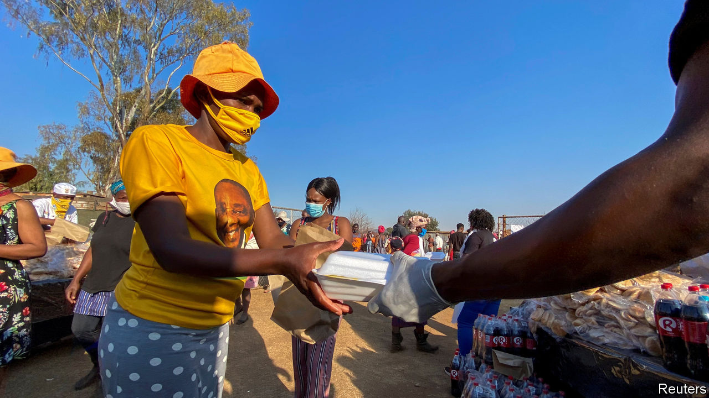

## Fund facts

# South Africa borrows from the IMF for the first time since apartheid

> And it may not be the last

> Jul 30th 2020JOHANNESBURG

ALTHOUGH IT IS rarely shy about spending other people’s money, the African National Congress (ANC), South Africa’s ruling party, has long been wary of the IMF. After Nelson Mandela came to power in 1994 the fund practically begged to help his new government. Mandela eventually saw the potential benefits of a cheap loan. But the ANC rejected the offer.

Opposition to the IMF has remained a shibboleth of the party. Yet on July 27th South Africa said it had agreed to a $4.3bn loan from the IMF. The deal signed by South Africa, one of 78 countries to have received covid-19-related help, is not a standard IMF programme and thus does not have stringent conditions. But the need for it nevertheless reflects the extent of the country’s underlying economic problems.

For some of the ANC’s self-styled comrades the worry about the IMF has perhaps been that it would make it harder for them to loot state coffers. For others, including Thabo Mbeki, Mandela’s successor, an IMF loan would have meant an intolerable violation of sovereignty.

Despite his doubts about the IMF, Mr Mbeki pursued macroeconomic policies so orthodox that a rabbi might have blessed them. Under Trevor Manuel, finance minister from 1996 to 2009, and Tito Mboweni, governor of the reserve bank from 1999 to 2009, South Africa closed its budget deficit and tamed inflation, which had averaged 14% in the 1980s. Though the ANC’s patronage machine kept whirring, GDP grew by more than 5% a year from 2005 to 2007.

Then came Jacob Zuma. Under his presidency corruption thrived and public spending ballooned. The negative effects of rigid labour markets and affirmative action intensified. Real GDP per person has shrunk every year since 2015. The ratio of public debt to GDP rose from 26% in 2008 to 56% in 2018. As early as 2015, writers such as R.W. Johnson warned that South Africa was heading for a bail-out.

This condition-light deal is not quite the Rubicon-crossing that some envisaged. But it is a toe in the water. In a letter to the fund, Mr Mboweni, who in 2018 returned to the government as finance minister, and Lesetja Kganyago, the reserve bank’s current governor, made several pledges, primarily relating to public finances.

They promised to cut the share of spending that goes on public-sector wages and to speed up structural reforms, for example to state-owned enterprises such as Eskom, the indebted electricity utility. They are open to a self-imposed “debt ceiling” (public borrowing is projected to hit 87% of GDP in 2024 before declining). But little of this is new. In June Mr Mboweni gave a statement to parliament with similar commitments.

South Africa’s problem is not a lack of ideas. It is politics. Although he has said he supports Mr Mboweni, President Cyril Ramaphosa has done little to show it. He has often made the job of his finance minister harder, for instance by promising that there would be no “mass retrenchment” of public employees, and by dithering over state enterprises. Corruption remains rife. Credit-rating agencies doubt that Mr Mboweni will meet his targets. Few believe that Mr Ramaphosa will face down trade unions or his party ahead of its National General Council and local elections in 2021.

So this may not be the last time South Africa turns to the fund. The next bail-out would come with tough conditions, which would infuriate the ANC. But the party ought to appreciate what Mr Mbeki and Mr Manuel understood: that the way to protect your economic sovereignty is to avoid the need for the IMF in the first place. ■