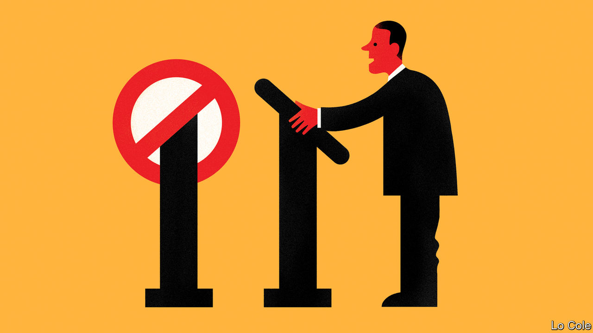

## Bello

# The return of rigged elections in Latin America

> A worrying new trend of banning politicians from running

> Jul 30th 2020

IN 1955 THE armed forces overthrew Juan Perón, Argentina’s populist president, driving him into exile. They banned him and his party from the election that eventually followed, a prohibition which remained in effect until 1973. A doddery Perón was then re-elected, but military rule soon returned. Apra, a Peruvian party with tendencies akin to Peronism, was similarly banned for decades. So, during the cold war, were many Communist parties. But with the spread of mass democracies across Latin America in the 1980s, such clear rigging of elections seemed a thing of the past. Any citizen could become president.

Now that fundamental democratic principle is under threat. Like several recent bad habits in the region, the revival of this one started in Venezuela. In 2008 Hugo Chávez’s regime barred Leopoldo López, an opposition leader, from public office for six years (Mr López was later arrested for organising protests in which 43 people died; he is now in the Spanish ambassador’s residence in Caracas). In 2017 the regime banned Henrique Capriles, who claimed to have won a presidential election against Chávez’s successor, Nicolás Maduro. As if this was not enough, in June Mr Maduro’s people used legal chicanery to take over the main opposition parties, installing regime stooges ahead of a legislative ballot later this year.

Despite its charade of holding elections, Venezuela is widely seen as a dictatorship. But the practice of narrowing the electoral field is spreading in democracies in the region. In Guatemala last year Thelma Aldana, a popular former attorney-general who had helped to jail a corrupt president, was kept off the presidential ballot by a charge of embezzlement her supporters say is bogus.

In other instances candidates have been barred after their conviction in controversial but better-founded cases. Luiz Inácio Lula da Silva, a left-wing former president of Brazil, was legally barred even when leading opinion polls in a presidential election in 2018, after his conviction for corruption was upheld by an appeal court. Rafael Correa, a populist former president of Ecuador now living in Belgium, received in absentia a jail sentence for corruption in April. Under the constitution he cannot run again. The electoral council went on to bar his party, claiming it submitted invalid signatures in its bid to register. The council also ruled that candidates have to register in person, meaning that if Mr Correa wanted to run for vice-president he would be arrested.

In Peru’s election in 2016 the electoral authority barred a well-placed candidate on a technicality. José Domingo Pérez, a Peruvian prosecutor, last month asked a court to ban for two and a half years (ie, until after the next election) Popular Force, the party of Keiko Fujimori, a former presidential candidate. He claims that it is a “criminal organisation” because it tried to cover up a $1.2m donation from Odebrecht, a Brazilian construction company, in 2011. Mr Pérez has been investigating Ms Fujimori for three years, but has yet to prove his case. She has spent 16 months in jail without trial.

Bolivia is the most worrying example of the new electoral prohibitionism. Last November Evo Morales, its president since 2006, was overthrown by a popular uprising amid claims of fraud in an election at which he sought an unconstitutional fourth term. An interim government led by a conservative senator, Jeanine Áñez, took office with the job of organising a fresh election. Twice postponed because of the pandemic, this is now due on October 18th. Ms Áñez exceeded her mandate as a caretaker by announcing that she would run. Polls suggest Mr Morales’s candidate, Luis Arce, might win. Ms Áñez’s supporters are seeking Mr Arce’s disqualification by the electoral tribunal, on a technicality. They also talk of postponing the poll indefinitely because of the pandemic.

Either would be a dangerous course. Disqualifying Mr Arce would deny legitimacy to the election’s winner and condemn Bolivia to years of conflict. Far better would be for Ms Áñez to back Carlos Mesa, a former president who was Mr Morales’s main rival last year. She should recall the analogy of Argentina in 1955. “Instead of destroying Peronism …persecution swiftly reinvigorated it,” concluded David Rock, a historian.

Mr Morales and Mr Correa were less than fully democratic in office, undermining the separation of powers and riding roughshod over opponents. Their critics fear that if allowed back, they would hold power for keeps. But democracy cannot be saved by curbing it.

## URL

https://www.economist.com/the-americas/2020/07/30/the-return-of-rigged-elections-in-latin-america
