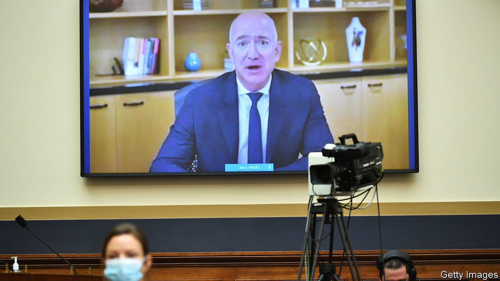
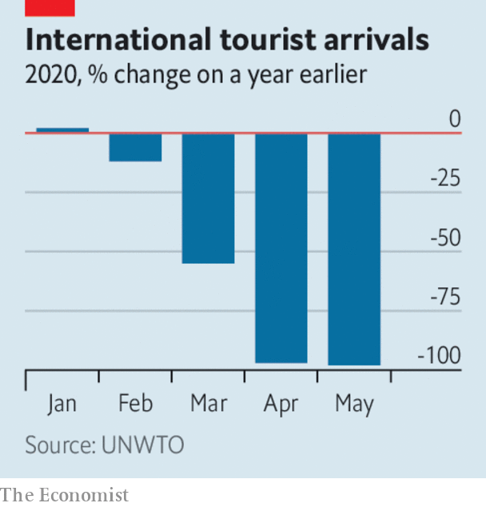

# Business this week

> Jul 30th 2020

The bosses of Amazon, Apple, Facebook and Google faced sharp questions (remotely) from a committee in America’s Congress about their companies’ market dominance and whether they should be broken up. It was the first time that Jeff Bezos, Amazon’s chief executive, had appeared before lawmakers. He insisted that his platform accounts for only a small portion of overall retail sales, and that it has supported a spurt in growth at small and medium-sized businesses. See [article](https://www.economist.com//united-states/2020/07/30/big-techs-grilling-provides-more-show-than-substance).

Google extended the period during which it expects employees to be working remotely because of covid-19. It will allow most staff to work from home until at least July next year. See [article](https://www.economist.com//leaders/2020/07/30/google-has-outgrown-its-corporate-culture). 

After terse negotiations within the party, the Republicans in Congress presented their plan for a new stimulus package, amounting to $1trn in spending. The bill extends a federal top-up to weekly unemployment benefits that has been in place since March, but slashes its generosity from $600 to $200; from September, the scheme would aim to replace 70% of workers’ lost wages. It also provides for another round of stimulus cheques to all households. The Democrats have alternative proposals.

The German economy contracted by 10.1% in the second quarter compared with the first, or by 11.7% from the same three months last year. On both measures, it was the biggest decline in quarterly records that stretch back to 1970. 

Russia’s central bank reduced its benchmark interest rate for the fourth time since January, lowering it by another quarter of a percentage point, to 4.25%. Elvira Nabiullina, the central bank’s governor, said that more cuts could come before the end of the year.

Saddled with huge write-downs of assets, around half of which originated in its British retail bank, Santander reported a quarterly loss of €11.1bn ($12.2bn), the first in the Spanish lender’s 163-year history. It is the biggest loss in the banking industry since UniCredit’s €13.6bn-worth of red ink in the last quarter of 2016.

Boeing reported a $2.4bn quarterly loss and made further cuts to production. It also confirmed that it will stop building the 747, which entered service in 1970, bringing cheaper long-haul flights to millions. See [article](https://www.economist.com//business/2020/08/01/air-travels-sudden-collapse-will-reshape-a-trillion-dollar-industry).

The World Tourism Organisation said that up to the end of May the industry saw a 56% fall in tourist arrivals, year on year, translating to $320bn in lost revenue, three times more than in 2009, during the financial crisis. Although tourism accounts for a much bigger part of the economy in smaller countries, a few big economies will feel the hit, too. Tourism is worth 7% of GDP in France and 12% in Spain; they are the number one and two destinations for holiday-makers.

Goldman Sachs reached an agreement with the government of Malaysia to settle criminal charges related to the 1MDB scandal. The bank will pay $2.5bn to the government and guarantee it receives at least another $1.4bn from 1MDB’S assets that have been seized by authorities around the world. Malaysia’s finance ministry said the settlement represented Goldman’s acknowledgment of misconduct by two former employees.

Nissan said it was on course to register an annual net loss of ¥670bn ($6.4bn); sales in the latest quarter dropped by half compared with the same three months last year. Like most carmakers, Nissan is reeling from plunging demand during the pandemic. Bucking that trend, PSA, the maker of Peugeots and Citroëns, reported a surprise profit for the first half of the year, even though revenues plummeted.

Jaguar Land Rover appointed Thierry Bolloré as its new chief executive. Mr Bolloré was ousted as CEO of Renault in a bout of corporate bloodletting last October, when the carmaker was still reeling from the Carlos Ghosn scandal. He will join JLR in September.

The average age of cars on American roads has approached almost 12 years, and around a quarter are at least 16 years old, according to IHS Markit. That is the highest in two decades; in 2002 the average age was around 9.5 years. Improved mileage and better- built vehicles mean that motorists are more inclined to hang on to their Betsy, perhaps more so now that commuting times have dropped during the pandemic, so cars should last even longer.

It failed to foresee the digital revolution that overthrew the market for camera film, but Kodak has been quick to seek out opportunities in the coronavirus crisis. The company signed a deal with the American government to make active pharmaceutical ingredients for generic drugs with the support of a development loan, the first under a programme to boost domestic production in response to covid-19. In the days following the announcement Kodak’s stock rose by 2,190%.