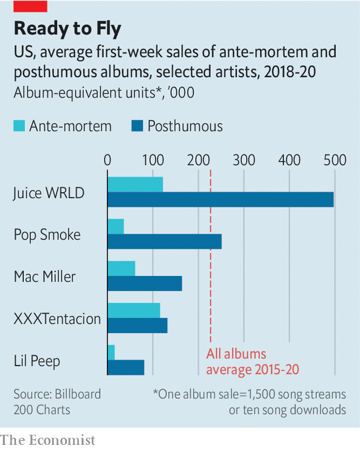

## Hip-hop hits

# Posthumous albums by young rappers are topping the charts

> For many fans, such success is bittersweet

> Jul 30th 2020

BY NOW HIP-HOP fans are all too familiar with the success that can come after an artist’s untimely death. Tupac Shakur and Notorious B.I.G., two American rappers who were murdered in 1996 and 1997 respectively, have sold more music in death than in life. Other well-known rappers to notch up hits after their deaths include Eazy-E (who died in 1995), Big L (1999) and J Dilla (2006). The past few years have seen a flurry of such posthumous hits. Juice WRLD, a rapper who died in December, has now reached the top of America’s Billboard 200 charts for the second time with his third album, “Legends Never Die”. By one reckoning, it is the most successful posthumous release in two decades.

An analysis by The Economist suggests that, in the world of hip-hop at least, the sales boost generated by posthumous albums may be growing. We looked at recent releases by hip-hop artists Lil Peep, XXXTentacion, Mac Miller, Pop Smoke and Juice WRLD. To measure the commercial success of a release, we used the album-equivalent unit (AEU), a measure developed by Billboard and Nielsen SoundScan, a research firm, which treats 1,500 song streams or ten song downloads as equivalent to an album sale. To avoid comparing albums released before and after the adoption of the AEU in 2014, we restricted our analysis to those released in the past five years.

All five posthumous albums in our sample performed better in their first week than previous works by the same artists. Pop Smoke and Juice WRLD’s posthumous albums, both released in the past month, amassed roughly four and seven times more AEUs, respectively, than the average releases during their lives. The posthumous works of Lil Peep and Mac Miller also recorded huge jumps in first-week sales (see chart).

Critics of posthumous releases—including fans, music critics and artists alike—say they are a corporate cash-grab and a blight on a dead artist’s career. They allege that record labels compiling posthumous releases cram them with filler tracks and unfinished songs, in part to boost sales figures (the AEU system favours releases with more songs). There may be some truth to that. Since 2018, according to our figures, there has been a positive correlation between the number of tracks on a chart-topping album and its AEUs during the first week. But the relationship is very weak.

So why do posthumous albums often outperform their ante-mortem predecessors? The answer may be humdrum. Fans rally to their beloved artists. The day after David Bowie’s death in 2016, the rocker’s streams on Spotify surged by 2,700% compared with their typical levels. Living musicians can benefit, too. Artists who re-emerge after a hiatus, as Tool, a Los Angeles band, did last August after 13 years without releasing an album, have seen their discographies appear on the Billboard charts. How unfortunate for artists to have more success when the mic cable is severed for good.

## URL

https://www.economist.com/united-states/2020/07/30/posthumous-albums-by-young-rappers-are-topping-the-charts
