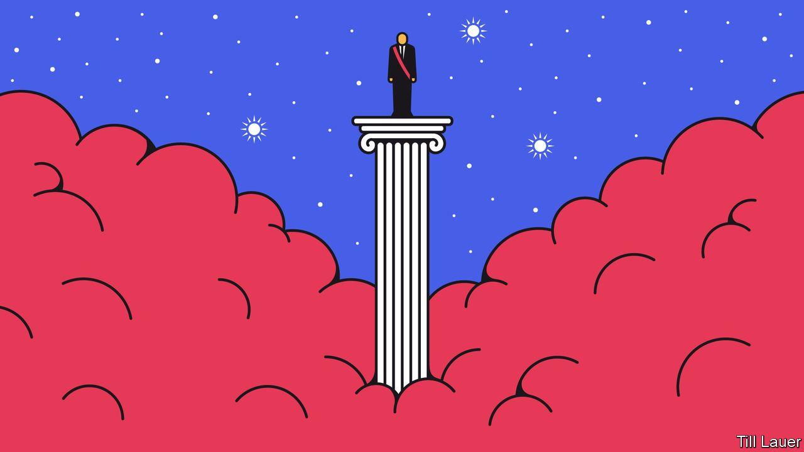

## Banyan

# Even in death, Lee Teng-hui is helping shape Taiwan’s identity

> He oversaw the island’s democratisation and in death is riling China again

> Aug 5th 2020

AS TAIWANESE CONTEMPLATED the momentous occasion, in March 1996, of being able to choose their president for the first time, China’s Communist Party launched a campaign of intimidation. Its leaders snarled on television. The armed forces simulated an invasion of Taiwan with beach-landing drills. And missiles landed in the seas around the island, in effect blockading it. The object of China’s fury: the incumbent president, Lee Teng-hui, whom they accused of wanting to split the motherland by formally declaring Taiwan’s independence.

China’s actions backfired. Taiwanese refused to be intimidated. Election rallies were huge. Children rode on parents’ shoulders, air horns lent a carnival air and taxis raced around the capital, Taipei, flying candidates’ flags out of their windows. Never has Banyan witnessed such a boisterous election. Mr Lee’s stump speeches drew crowds to flatter a rock star. Tall and with a near-permanent toothy grin, he was the first leader of the Kuomintang (KMT, or Nationalist) party to address people in their native Taiwanese rather than in Mandarin, the language that KMT carpetbaggers had brought with them when they fled the mainland, defeated by the Communists in 1949. Taiwanese, he said, should not fear China’s “state terrorism”. His victory was emphatic, with more votes than the three other candidates combined. Taxis were still beeping the following day.

Mr Lee died on July 30th, aged 97. The arc of his remarkable life traced Taiwan’s own modern history. He was born under Japanese colonial rule, to a farming family. He studied in Kyoto and joined the Japanese imperial army, though he never saw action.

To Mr Lee, Japanese rule seemed mild compared with that of the KMT under Chiang Kai-shek. The KMT existed to reclaim the mainland from the Communists (even today, Taiwan’s official name is the Republic of China). It brooked no dissent. Anti-government protests on February 28th 1947 led to more than 20,000 Taiwanese—students, artists, doctors, lawyers and intellectuals—being rounded up and shot. It was the start of a decades-long “White Terror”. It was only in 1987 that Chiang’s son, Chiang Ching-kuo, finally lifted martial law.

A young Mr Lee dabbled with communism. A more enduring inspiration was Zen Buddhism. It taught that there is no shame in bending like a reed, nor any wisdom in hurrying. In 1961 Mr Lee was baptised a Christian, and if his evangelism hinted at a messianic streak, it was also rooted in grassroots activism. As an agricultural economist, he was at the heart of Taiwan’s development. A leap in the output of the island’s farms kick-started an economic transformation which later led to calls for political freedom.

For years Mr Lee kept his head down. Still, state goons kept a dossier on him, even filling it with titbits from KMT informers at Cornell University, where he received a PhD. His appointment in 1972 to a ministerial portfolio under Chiang Ching-kuo was an extraordinary turn. Given mounting popular anger at rule by mainlanders, Chiang turned to Taiwan-born politicians to lend the regime legitimacy. Sometimes, Mr Lee later said, of his decision to join the KMT, the safest place “is the most dangerous”.

Mr Lee, in the words of Richard Kagan, his biographer, was the “ultimate Trojan horse”. By 1978 he was mayor of Taipei and by 1984 Chiang’s vice-president. When Chiang died four years later, Mr Lee assumed the presidency, despite efforts by KMT hardliners to thwart him. After students began calling for full-blown democracy in 1990, he promised to institute it, dispensing with the farcical notion that Taiwan ruled China in the process (China did not reciprocate). When he stepped down in 2000, his informal support helped propel the independence-minded Chen Shui-bian to victory. Soon after, the KMT kicked the Trojan horse out.

China’s communists loathed Mr Lee, a “deformed test-tube baby cultivated in the political laboratory of hostile anti-China forces”, especially for promoting a distinct Taiwanese identity, separate from that of China. But he, not they, won the battle for hearts and minds: two-thirds of the island’s citizens identify as Taiwanese first; only 3% as Chinese first. He also helped resist China’s efforts to isolate Taiwan diplomatically. America’s health secretary, Alex Azar, who will this month become the most senior American official to visit Taiwan in decades, may attend his funeral. Even on the way to his grave, Mr Lee has a knack for needling the bullies in Beijing.

## URL

https://www.economist.com/asia/2020/08/05/even-in-death-lee-teng-hui-is-helping-shape-taiwans-identity
