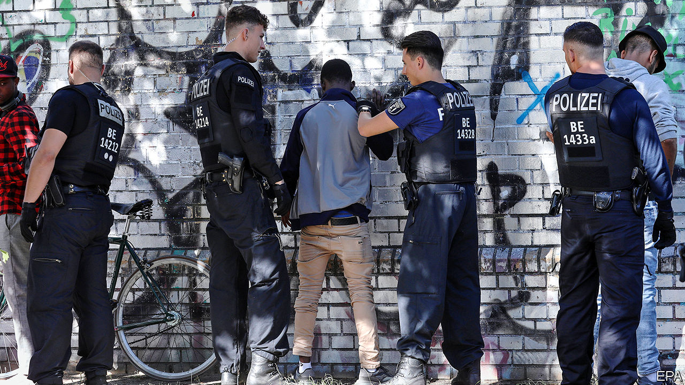

## See no evil

# American ideas about racism are influencing Europe

> But it is hard to measure bias in countries that don’t collect ethnic data

> Aug 8th 2020

FROM THE 1940s-60s, philosophical ideas about racism tended to flow westward across the Atlantic. Writers of the Francophone négritude school such as Léopold Senghor and Aimé Césaire foreshadowed America’s “black is beautiful” movement, as did Jean-Paul Sartre’s essay “Black Orpheus”. Frantz Fanon’s polemics against French colonialism influenced American debates on violence in the civil-rights movement. African-American writers and musicians like Richard Wright, Miles Davis and Nina Simone went to Europe to escape America’s colour bar. Analyses of Nazi racism by the philosophers of Germany’s Frankfurt School crossed the Atlantic with Hannah Arendt and Herbert Marcuse. Marcuse’s student Angela Davis earned her doctorate in Berlin; after she joined the Black Panthers, ending up on the run from the FBI, James Baldwin wrote in support of her from his home in France. Segregationists made the most of all this, disparaging the civil-rights movement as a conspiracy of European socialist eggheads.

This summer, as the Black Lives Matter movement spread internationally, some Europeans felt that the tide had turned: the latest American ideas about racism were now flowing into Europe. Academics—especially those who have studied in America—have embraced concepts like institutional racism and white privilege, eagerly translated by local news media (“weisse Privilegien”, “le privilège blanc”). Activist journalists like Rokhaya Diallo in France, Alice Hasters in Germany and Clarice Gargard in the Netherlands are elated that anti-black racism is being taken so seriously. So are many Europeans, black and otherwise.

Yet others see it as part of what Régis Debray, a French centre-left thinker, calls the “Americanisation of Europe”. Some argue that the focus on anti-black racism diverts attention from bigotry against Muslim minorities, who are more numerous in Europe. Paul Scheffer, a Dutch immigration scholar, thinks applying an American conception of race gets it wrong: “African-Americans’ history is one of slavery and forced segregation, but the history of black communities in Europe is one of migration,” with more social mobility and fluid status. The question is whether the new American-influenced vocabulary fits.

One tug-of-war is over the term institutional racism, meant to convey that systems can produce racist outcomes even if no one in them is racist. French and German government bodies accept the term; but deny it describes them. However, they generally do not gather data on ethnicity, an ostensibly anti-racist measure that makes it almost impossible to detect institutional racism. Last month Germany’s interior minister cancelled an inquiry into institutional racism in the police. France’s interior minister resists calls to probe the police. Yet in 2015 a study found that 22 out of 26 recent victims of French police killings were “visible minorities”. Some Dutch cops cheerfully admit racial profiling, notably in the case of Typhoon, one of the country’s top rappers, whose car they stopped in 2016 because it was posh and he is black. In June Mark Rutte, the Dutch prime minister, said the Netherlands suffers from systemic but not institutional racism. No one knew what he meant.

There is more to institutional racism than policing. In most European countries some groups with immigrant backgrounds do worse in school than white natives. Exams relying heavily on language proficiency often split students into university- or vocational-track education by the age of 12. Residential segregation occurs partly because immigrants are steered into public housing and partly because of discrimination. In one study 95% of callers with native German accents got appointments to view houses in a wealthy neighbourhood of Bremen, whereas only 24% of callers with Turkish accents did.

Then there is employment discrimination. A Dutch study in 2018 that responded to job listings with imaginary résumés, varying only their ethnicity, found that fictitious applicants with non-Western immigrant backgrounds got 30% fewer invitations to interviews than native whites. Depressingly, a similar study in 1977 got about the same result. In the same vein, in 2019 the Dutch tax authority was found to have withheld child benefits wrongfully from some 11,000 parents, most with non-Western immigrant backgrounds, over baseless suspicions of fraud. Many were financially ruined and the government will pay them €500m ($590m), but the authority was exonerated of racism because it had selected them on the basis of dual nationality.

Those who think terms like institutional racism fit America but not Europe make some good points. Of the 1.5m convicts in American prisons in 2018, a third were black, nearly treble the black share of the population. It is uncertain how skewed French and German law enforcement are (since ethnic data are scarce), but overall they shoot and jail people at less than a fifth America’s rate, so the damage is less grave. Even in segregated European cities like Paris, no group approaches the degree of segregation of blacks in American cities. Europe’s generous welfare states also help to smooth out racial disparities. More subtly, “Black Lives Matter” takes on a different flavour in countries where African and Caribbean minorities (often former colonial subjects) are part of a fluid hierarchy of groups of colour. Whereas the income gap between black and white Americans has grown since 2000, all Dutch minority groups are catching up, if slowly.

None of that erases the reality of discrimination in Europe. Indeed, Ms Gargard says, to belittle the new vocabulary of racism as an ill-fitting American import is to dodge responsibility: “It’s been difficult to talk about racism in European countries because we like to pretend we are tolerant, and that racism is something that happens in the United States.” ■

## URL

https://www.economist.com/europe/2020/08/08/american-ideas-about-racism-are-influencing-europe
