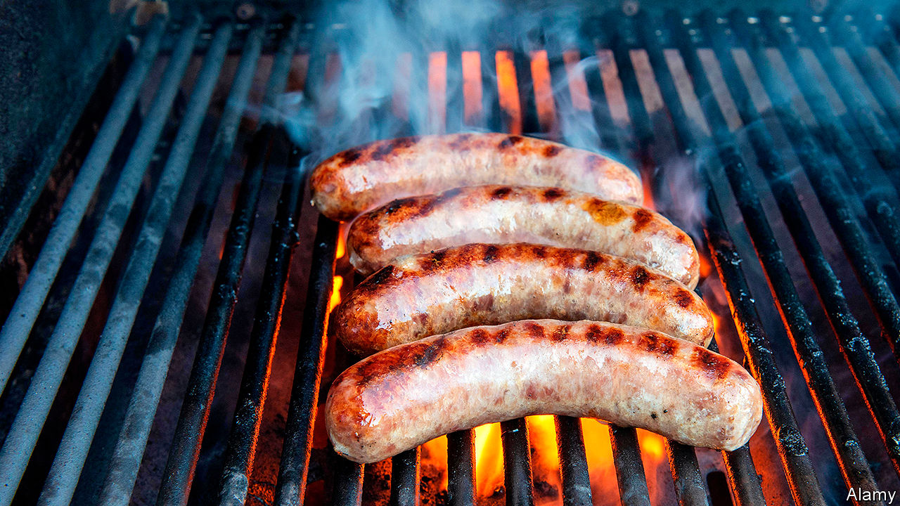

## Good grilling

# An indoor barbecue to prevent pollution problems

> And avoid complaints about fumes from restaurants

> Aug 8th 2020

AS THEY REOPEN after lockdown, many restaurants are firing up their barbecues. Diners appreciate food grilled over glowing charcoal embers, but the neighbours often do not. Pollution levels near restaurants can be notably higher than average, largely because of emissions from kitchens. With the increasing popularity of indoor barbecuing, it is a problem that is set to get worse.

Faced with complaints from residents about fumes and lingering smells, the German Environment Agency asked Mohammad Aleysa, an expert in combustion technology at the Fraunhofer Institute for Building Physics in Stuttgart, to investigate. The results of his experiments were so shocking they drove Dr Aleysa and his research team to invent a cleaner system for indoor charcoal grilling.

The researchers tested a commercial grill, complete with the sort of multi-stage filtering system used in many—though by no means all—restaurants. Apart from typical pollutants such as nitrogen oxides, carbon monoxide and particulate matter, they also discovered polycyclic aromatic hydrocarbons. These cancer-causing chemicals are mainly produced by the incomplete combustion of fats and oil-based marinades.

The researchers estimated that if their half-a-square-metre grill was used for nine hours a day, it would release between 400 and 500 kilograms of fine and ultrafine particulate matter into the air, along with 1.5 tonnes of hydrocarbons, every year. With many restaurants using 2.5-square-metre grills 16 hours a day, the level of pollution from most commercial operations would be much higher.

The researchers are investigating which extraction systems best protect neighbours and restaurant employees. Taller chimneys are one option. But Dr Aleysa suspects they would just shift the pollution elsewhere. The results of these tests will be published next year.

Meanwhile, Dr Aleysa’s team have come up with their own solution: a new kind of grill, which they reckon can cut pollutants by 90%. Dr Aleysa is reluctant to go into specifics. But the basic idea is that before being vented to the outside, the fumes are sucked back down through the embers and into a “combustion zone”, where hydrocarbons and odour compounds are fully burnt. That lessens the need for expensive extraction systems and fiddly filters that must be regularly cleaned.

An industrial partner is keen to put the grill into production. It could go on sale by the middle of next year. It will cost a bit more than a standard grill, says Dr Aleysa. But he believes that would be offset by lower maintenance costs. Better air quality around restaurants would be welcome. But the big test will be whether chefs believe the new grill can produce that same barbecue flavour.

For more coverage of climate change, register for The Climate Issue, our fortnightly [newsletter](https://www.economist.com//theclimateissue/), or visit our [climate-change hub](https://www.economist.com//news/2020/04/24/the-economists-coverage-of-climate-change)

## URL

https://www.economist.com/science-and-technology/2020/08/08/an-indoor-barbecue-to-prevent-pollution-problems
